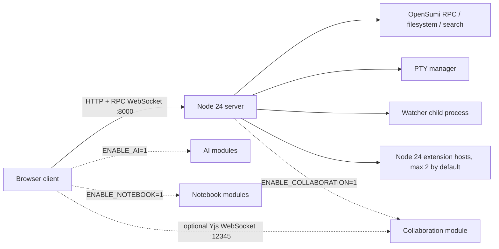

# OpenSumi Node 24 兼容运行时与 Go Workspace Agent 方案

> 评审目标：确认 OpenSumi 以 pnpm 11 + Node.js 24 作为唯一生产 JavaScript 运行时，产品入口收口为 `client/` 与 `server/`，保持 VS Code Node 扩展兼容，并通过 WebSocket 资源边界和协同生命周期治理降低内存失控与整机崩溃风险。

## 1. 背景与现状问题

本仓库原有框架能力分布在大量 `packages/*` 中，产品启动入口与开发工具耦合。迁移过程中曾验证 GoFrame 网关与 Node worker 双栈，但扩展宿主、PTY、OpenSumi RPC 和 Yjs 协同仍依赖 Node；公共双栈入口没有消除 Node 内存，只增加了代理、端口和排障成本。因此当前仍保留一个 Node 24 公共服务入口，只允许有独立资源所有权且通过测量门槛的 OS 服务进入私有 Go Workspace Agent。

已确认的稳定性问题不是单纯由语言造成：

1. 连接层曾用一个共享定时器维护心跳，新连接会取消旧连接的心跳。
2. RPC WebSocket 缺少明确的连接数、消息大小和慢消费者边界。
3. 协同文件初始化缺少引用计数、文档体积和空闲回收边界；读取失败时浏览器还可能永久等待未创建的 Y.Map。
4. `y-websocket` 可从 URL 创建任意房间；若公网入口不限制房间名，攻击者可制造无界文档状态。
5. 扩展宿主和终端属于高内存能力，必须限制进程数并及时回收空闲资源。

| 选项 | 扩展兼容 | 运维复杂度 | 当前仓库实测风险 | 结论 |
| --- | --- | --- | --- | --- |
| Node 24 单运行时 | 完整复用现有扩展链路 | 一套运行时、一个服务入口 | 需要主动治理内存和 WebSocket | 采用 |
| Go + Node worker | 扩展仍需 Node | 两套构建、代理和回滚链路 | Node RSS 仍存在 | 删除 |
| Bun 全量替换 | Node API 仅部分兼容 | 需同时维护兼容补丁 | Bun 1.3.14 加载本仓库 `spdlog` 时发生原生崩溃 | 不采用 |

## 2. 目标、边界与不变项

### 2.1 目标

- 使用 Node.js 24 和 pnpm 11 完成安装、构建、开发和生产启动。
- 产品目录固定为 `client/`、`server/`；`packages/*` 继续作为可复用框架包。
- 浏览器继续通过 `ws://<host>:8000/service` 使用既有 OpenSumi RPC。
- AI、Notebook 和协同均从默认产品入口拆出，通过环境开关按需装配；默认服务不加载这些重模块。
- 单个失活连接、超大消息、慢消费者或异常房间请求不能无限占用服务端资源。

### 2.2 不变项

- OpenSumi RPC 序列化、通道路径和客户端协议保持兼容。
- 传统 VS Code Node 扩展继续由 Node 扩展宿主执行。
- Yjs 文档内容和 awareness 协议保持由 `y-websocket`/Yjs 实现，不改数据格式。
- npm 包发布边界仍是 `packages/*`，不把全部框架包物理搬入 `client` 或 `server`。

### 2.3 非目标

- 本次不承诺把所有框架包合并成少量大包；包数量与运行时内存不是同一指标。
- 本次不把 Yjs、PTY 或扩展 API 重写为另一种语言。
- 本次不声称已经完成多租户级的协同进程隔离；当前先完成单进程资源上限，独立 worker 可作为后续容量工程。
- 本次不把 Bun 加入生产锁文件、CI 或运行链路。

## 3. 总体架构设计



浏览器只有一个主服务入口；协同端口只在显式启用模块时监听。扩展宿主继续是独立子进程，既保持插件兼容，也避免把第三方插件代码直接执行在 HTTP/WebSocket 主进程中。

产品组合分为以下档位：

| 档位     | 命令                          | 启用模块                        |
| -------- | ----------------------------- | ------------------------------- |
| 默认轻量 | `pnpm dev`                    | IDE 核心、文件、终端、扩展宿主  |
| AI       | `pnpm dev:ai`                 | 默认轻量 + AI Native            |
| 完整     | `pnpm dev:full`               | 默认轻量 + AI Native + Notebook |
| 完整协同 | `pnpm dev:full:collaboration` | 完整 + Yjs 协同                 |

这些开关影响模块是否装配，不牺牲框架包或 VS Code 扩展 API。旧的 `packages/startup/entry/web/*` 入口仍显式装配完整模块，供已有集成方兼容使用。

目录职责如下：

```text
client/        浏览器产品组合、Rspack 构建和开发服务器
server/        Node 24 产品服务入口、运行参数和生产构建
packages/      OpenSumi 可复用浏览器端、Node 端与公共框架包
go/            默认关闭的私有 Workspace Agent pilot
configs/       TypeScript、Jest、ESLint 等集中工程配置
tools/         构建、测试、Electron 和开发辅助工具
```

## 4. 核心实现与资源模型

### 4.1 RPC WebSocket 生命周期

`BaseCommonChannelHandler` 使用一个调度器遍历所有活动连接，而不是为最后一个连接保存共享递归定时器。连接建立时加入集合，关闭时删除；集合为空时停止定时器。这样连接数量增加不会使旧连接失去心跳，也不会为每个连接创建独立定时器。

Node WebSocket 每次心跳按以下顺序检查：

1. socket 已关闭时跳过。
2. `bufferedAmount` 超过上限时终止慢客户端。
3. 上一轮 ping 未收到 pong 时终止失活客户端。
4. 标记为待 pong 并发送下一次 ping。

服务端同时监听 WebSocket server 和单连接 `error`，避免未处理的 EventEmitter `error` 直接结束进程。

### 4.2 协同服务生命周期

协同服务强制所有连接使用 `ROOM_NAME`，升级请求的 URL 房间不匹配时返回 404。连接达到上限时返回 503；消息超过上限由 `ws` 拒绝；发送缓冲超过上限时由单一压力检查定时器终止慢客户端。

文件初始化请求以 `PendingContentRequest` 跟踪。请求完成后在 `finally` 中删除记录；文件在读取期间被删除时，服务会标记请求取消、拒绝等待方，并阻止迟到的磁盘读取结果把 Y.Text 重新写回文档。每个 URI 都按绑定数量引用计数，最后一个编辑器释放后才删除共享内容；全部客户端离开 60 秒后，服务销毁 Y.Doc、Y.Map、文件事件监听和 `@y/websocket-server` 的全局房间引用。读取失败会明确拒绝浏览器端等待，而不是让模型绑定永久挂起。

协同服务另设文档数量、单文档 UTF-8 字节数、房间 CRDT 编码状态和并发初始化数上限。累计更新量越过房间上限后才执行一次真实状态编码检查；确认超限时终止该房间连接并重建 Y.Doc，避免只删除 Y.Text 后仍保留 CRDT 历史。主服务 readiness 不健康时，协同升级请求与 RPC 一样拒绝新连接，避免内存压力期间继续创建 Yjs 状态。

### 4.3 默认资源边界

| 环境变量                                |       默认值 | 作用域                       |
| --------------------------------------- | -----------: | ---------------------------- |
| `WS_HEARTBEAT_INTERVAL`                 |     30000 ms | RPC 连接心跳                 |
| `WS_MAX_CONNECTIONS`                    |          512 | RPC 同时连接数               |
| `WS_MAX_PAYLOAD`                        |       32 MiB | 单条 RPC WebSocket 消息      |
| `WS_MAX_BUFFERED_AMOUNT`                |       16 MiB | RPC 单连接待发送缓冲         |
| `COLLABORATION_MAX_CONNECTIONS`         |           64 | 协同同时连接数               |
| `COLLABORATION_MAX_PAYLOAD`             |        2 MiB | 单条 Yjs 消息                |
| `COLLABORATION_MAX_BUFFERED_AMOUNT`     |        2 MiB | 协同单连接待发送缓冲         |
| `COLLABORATION_MAX_DOCUMENTS`           |          128 | 单进程已加载文档数           |
| `COLLABORATION_MAX_DOCUMENT_BYTES`      |        2 MiB | 单文档 UTF-8 内容上限        |
| `COLLABORATION_MAX_STATE_BYTES`         |       32 MiB | 协同房间 CRDT 状态上限       |
| `COLLABORATION_MAX_PENDING_DOCUMENTS`   |           32 | 并发文档初始化数             |
| `COLLABORATION_IDLE_TIMEOUT`            |     60000 ms | 无客户端文档回收时间         |
| `MAX_EXTENSION_HOSTS`                   |            3 | 扩展宿主子进程数             |
| `EXTENSION_HOST_MAX_OLD_SPACE_SIZE`     |      256 MiB | 单扩展宿主 V8 堆上限         |
| `MAX_MANAGED_EXTENSION_PROCESSES`       |            3 | 单管理器跟踪的 Node 子进程数 |
| `EXTENSION_HOST_IDLE_TIMEOUT`           |     60000 ms | 断连扩展宿主回收时间         |
| `EXTENSION_HOST_STARTUP_TIMEOUT`        |     15000 ms | 扩展宿主启动握手上限         |
| `EXTENSION_HOST_SHUTDOWN_TIMEOUT`       |      2000 ms | 优雅关闭最长等待时间         |
| `EXTENSION_HOST_ACTIVATION_DIAGNOSTICS` |         关闭 | 插件激活热点诊断，压测时开启 |
| `OPENSUMI_EXTENSION_DIR`                | 产品插件目录 | 生产插件安装与扫描目录       |
| `WATCHER_HOST_MAX_OLD_SPACE_SIZE`       |      256 MiB | 文件监听子进程堆上限         |
| `TERMINAL_IDLE_TIMEOUT`                 |     30000 ms | 断连后等待 WebSocket 重连    |
| `TERMINAL_PERSISTENT_SESSION_TIMEOUT`   |   1800000 ms | 持久终端无人持有后的恢复租期 |
| `SERVER_MAX_HEAP_USED_MB`               |      448 MiB | 超过后 readiness 失败        |
| `SERVER_MAX_RSS_MB`                     |      768 MiB | 超过后拒绝新 RPC 连接        |
| `HTTP_MAX_CONNECTIONS`                  |          512 | HTTP/TCP 同时连接数          |

生产 `start` 命令把主进程 V8 old-space 限制为 512 MiB；AI 档位为 768 MiB。开发 server 同样固定为 512 MiB，AI 档位为 768 MiB；扩展宿主与 watcher 子进程的 V8 old-space 均限制为 256 MiB。默认 Extension Host 容量与当前产品边界一致，为 3 个；达到上限时只回收已经断连或确认死亡的宿主，三个宿主均活跃时拒绝新建并保留现有会话，不再按创建顺序杀掉最早的活跃用户。宿主必须在 15 秒内完成启动握手，超时会强制清理并归还名额；断连宿主在 60 秒后回收，重连则取消回收定时器。Extension Host 重启与浏览器连接使用独立生命周期：仅重启 Host 时保留浏览器 RPC 代理，浏览器真正断连后即使 Host 已先退出也会有界清理代理、主线程连接和 zombie 标记；旧连接晚到的 close 事件不能销毁新连接。终端先保留 30 秒 WebSocket 重连窗口；持久终端进入无人持有状态后最多再保留 30 分钟，恢复同一 session 会取消回收，租期到期则结束 PTY 并清理 session、缓存和监听。临时终端、扩展持有终端与 Electron 终端不进入该租期。普通 client 的 Rspack 开发进程限制为 512 MiB，AI/Notebook 档位为 768 MiB；默认生产 client 构建为 768 MiB，完整档为 1024 MiB。默认关闭 source map，调试时用 `SOURCE_MAP=1` 显式启用，避免大型源码图长期占用 Rspack 常驻内存。`/healthz` 与 `/readyz` 除主进程内存快照外，还返回 Extension Host 的当前数量、断连数、浏览器代理数、主线程连接数、饱和状态、配置预算以及创建/崩溃/回收/拒绝/启动超时累计计数；Extension Host 饱和本身不切断现有会话，所以该诊断不直接改变 readiness。`/readyz` 仍在主进程 heap/RSS 超限时返回 503，同时 RPC 和协同 WebSocket 升级也返回 503，避免内存压力期间继续接纳新会话。HTTP 服务另设 15 秒 headers timeout、30 秒 request timeout、16 KiB header 和每 socket 1000 次请求上限，用来限制慢连接与无界 keep-alive。

生产 Server 默认把 Marketplace 插件目录固定为产品内的 `tools/extensions`，不会继承运行账号的 `~/.sumi/extensions`；部署需要持久化插件时，通过 `OPENSUMI_EXTENSION_DIR` 指向受控挂载卷。开发环境未显式配置时仍保留原目录，避免破坏本地插件安装体验。插件能力没有关闭：含 Node `main` 的 workspace/debugger/terminal/TypeScript Server 插件继续进入 Node Extension Host；同时提供 `browser` 入口且明确优先 `extensionKind: ui` 的插件改由浏览器 Worker 承担，减少服务端宿主加载量和 UI 插件故障对后端进程的影响。

扩展列表动态更新时，Node 与 Worker Host 会把已删除、禁用或被其他路径/版本替换的已激活插件视为 stale：先运行其 deactivate hook，再释放 ExtensionContext subscriptions 和按插件缓存的 API；Node Host 还会按组件边界清理旧插件真实目录下的 `require.cache`。这避免插件安装、升级和反复启停后，旧模块图一直保留到整个会话退出。

同一个插件被多个激活事件并发触发时，Node 与 Worker Host 现在只执行一次 `activate()`，其余调用复用同一个 Promise；无论成功或失败都会删除 in-flight 引用。插件更新会先等待正在执行的旧版本激活结束再 deactivate，Node Host 优雅关闭也会先等待激活收敛再释放订阅。容量门禁要求每个热点插件的 `activationCount` 精确等于 `reportingHosts`，因此同一宿主重复激活不能被“进程没有崩”掩盖。

“所有声明 browser 入口的双入口插件都优先 Worker”候选已被真实浏览器门禁否决：受控目录中的 Emmet 与 Merge Conflict 清单虽声明 browser 路径，部署产物却不存在对应文件，三会话产生 12 个 `Not Found`。生产继续保持保守路由，仅 browser-only 或明确 `extensionKind: ui` 的插件进入 Worker；未声明或偏好 workspace 的双入口插件仍留在 Node，直到部署产物本身通过可执行入口验证。

插件激活热点诊断默认关闭，避免常态路径调用 `process.memoryUsage()`、扫描 `require.cache`，也避免公开的健康接口泄露已安装插件清单。容量脚本会用 `EXTENSION_HOST_ACTIVATION_DIAGNOSTICS=enabled` 显式开启：每个宿主最多保留 64 个插件记录，健康接口只聚合前 10 个，不返回 client ID，宿主释放时同步删除记录。内存增量是在并发激活窗口内观测到的进程差值，只用于定位候选热点，不等于该插件独占或因果分配的内存；该开关只应在内部诊断端点受保护时使用。

容量脚本的 `--extension-dir` 会把受控插件目录写入证据并显式传给每个新 Server；提供该参数后，每个 Extension Host 都必须产生非空激活诊断且不能有激活失败，防止空的生产插件目录被误判为“完整插件集已通过”。活跃阶段还要求 Extension Host、浏览器代理、主线程连接都精确等于会话数，浏览器关闭后要求三者与断连数全部归零。当前三会话完整插件冒烟中，两条路径的 Git 启动插件组都是主要堆增长候选；Node watcher 轮的 `vscode-icons` 最长激活为 `2406 ms`，GitHD/Emmet 分别持有 `97/43` 个订阅。它们都在三个宿主中成功激活，因此这些数字只确定下一步分析顺序，不构成禁用插件的结论。

两个 WebSocket server 默认关闭 `perMessageDeflate`，避免压缩上下文带来的额外常驻内存和压缩型拒绝服务面。生产部署可降低上限，但提升上限前必须用相同工作区和扩展集压测。

2026-08-28 使用生产构建、同一真实仓库和 3 个并发 Chromium 会话执行 Extension Host 治理冒烟。Node Watcher 与 Go Workspace Agent 两种路径都保持精确 3 个 Extension Host，Search、Quick Open、浏览器错误门禁和关闭回收通过；浏览器关闭后两条路径的 Extension Host、终端与 Node Watcher 都归零。首次并发启动暴露了多个浏览器同时写 `layout-global.json` 的乐观锁竞态，存储层现改为读取最新 JSON、合并本次键级更新并在冲突时有界重试，避免用忽略错误或覆盖整个文件掩盖并发写。该轮只有每种路径 1 次运行，只是三会话功能与回收冒烟，不是 Go/Node 内存优劣资格：Node 路径 Extension Host P95 RSS 为 `243679232` bytes，Agent 路径为 `478248960` bytes，后者明显更高，必须保留先前多轮结果并继续以相同扩展集做重复采样，不能从单轮得出 Go 会稳定降低 Extension Host RSS。

后续使用受控但完整的 VS Code 插件目录、20 秒暖机、8 秒整树采样，对 Node Watcher 与 Workspace Agent 各执行 3 次全新 3 会话运行。跨轮中位数显示整树 P95 RSS 从 `504168448` bytes 降到 `259211264` bytes，下降 `48.59%`；Search P95 都是 `186 ms`，File Search 为 `91/93 ms`，`2.20%` 回退仍在 `10%` 门禁内。六轮均保持精确 3 个 Extension Host，健康计数证明每轮创建 3 个、崩溃/拒绝/启动超时均为 0，浏览器关闭后 active 归零并累计正常 dispose 3 个。容量脚本现把这些计数作为硬门禁，不能再由“崩溃后快速补起的新进程”伪装成稳定结果。该证据适用于用户限定的 3 会话产品边界，仍不等于 50 会话发布资格。

浏览器代理生命周期门禁第一次运行时虽已回收三个 Extension Host，却检测到 `clientServiceProxies=3`，从而暴露 Host 销毁与浏览器 close 交错时过早清除断连标记的竞态；该失败没有被当作通过结果。修复后用相同完整插件集重跑，Node Watcher 与 Workspace Agent 两种路径在活跃阶段都为 `active=3/clientServiceProxies=3/mainThreadConnections=3`，关闭后四项与 disconnected 全部归零，崩溃/拒绝/启动超时均为 0。该单轮的整树 P95 RSS 为 `369147904/252067840` bytes，下降 `31.72%`，Search P95 为 `198/181 ms`，File Search 为 `99/84 ms`；它只证明新连接回收门禁和本轮性能未回退，正式性能结论仍以前述三轮中位数为准。

浏览器侧 Extension Host 重启现按单事务串行处理：并发 `Always` 请求复用同一个 Promise，`WhenExit` 检查期间到达的 `Always` 会升级当前事务，页面隐藏期间只保留最强策略并等待恢复可见，避免崩溃通知、可见性恢复和手动命令并发拉起多个宿主。使用生产构建与完整插件目录的一个真实 Chromium 会话连续执行 10 次“重启插件主进程”：`created` 从 1 增至 11、`disposed` 从 0 增至 10，每轮都保持 `active=1/clientServiceProxies=1/mainThreadConnections=1`，崩溃、拒绝、启动超时均为 0；整树 RSS 在 `219643904` 到 `318734336` bytes 之间、Extension Host RSS 在 `132841472` 到 `196640768` bytes 之间波动，没有随轮次单调上涨。关闭浏览器后 `created=disposed=11`，active、disconnected、代理和主线程连接全部归零。该证据只覆盖单会话反复重启与最终回收，不能替代多会话容量压测。

Extension Host 的 V8 semi-space 也用同一完整插件集各做了 3 轮候选验证，但没有进入默认配置：8 MiB 候选虽然降低 RSS，Agent Search P95 相对 Node 回退 `10.95%`，超过 `10%` 门槛；16 MiB 候选保住 Search/File Search 延迟，整树内存门槛却失败。两档候选均已从生产启动参数撤回，不能把单独压低 V8 新生代当作无损优化。

### 4.4 依赖与原生模块治理

- 包管理器统一为 pnpm workspace，并用一致性检查阻止同一个依赖在不同 workspace 漂移版本。
- 全仓 TypeScript 构建按 project reference 串行执行，普通项目使用 512 MiB 堆上限，AI Native、Extension、Notebook 三个大项目使用 768 MiB；macOS 可用内存低于 20%（Linux 默认低于 1 GiB）时在下一个项目开始前停止。失败时不再先删除全部 `lib`，可用 `OPENSUMI_BUILD_FROM=<tsconfig>` 从指定 project reference 续跑。全仓 ESLint 按文件数和源码体积分批，每个批次限制为 384 MiB；Jest 固定 `--runInBand`。构建、lint 与测试门禁不得在本机并行执行。
- 搜索原生包由弃用的 `@opensumi/vscode-ripgrep` 迁到 `@opensumi/ripgrep`。
- 日志原生包由 `spdlog` 迁到维护中的 `@vscode/spdlog`。
- 协同服务端由 `y-websocket/bin/utils` 迁到 `@y/websocket-server`，客户端继续使用兼容 Yjs 13 的协议。
- `glob`、`rimraf`、CSS 压缩器、Playwright 和评论提及组件已迁到支持 Node 24 的实现。
- AI SDK 的 `zod` 固定在兼容的 v3 范围，避免 pnpm 解析到不满足 AI SDK peer contract 的 v4。
- `core-common` 对 Electron、AI SDK 与 ACP SDK 只有类型引用，因此三者已从生产 dependencies 移到开发依赖与可选 peer；默认 Web IDE 的生产依赖图不再因为公共类型包携带 Electron/AI 运行时，AI Native 与 Electron 产品包仍显式声明自己的实际依赖。

### 4.5 前端构建链治理

- 默认产品构建器和浏览器扩展 worker 均从 Webpack 迁移到 Rspack 2，生产压缩、持久缓存、开发服务器、WASM 和资源模块均由 Rspack 接管；`client/` 与 `packages/extension` 不再保留产品 Webpack 配置或回退命令。Electron、CLI 和旧示例中仍存在的 Webpack 构建是后续独立迁移边界。
- 默认开发档从各 workspace 包的 `lib` 读取已编译 JavaScript，只让 Rspack 编译 `client/src` 与 startup 产品入口，避免 `tsconfig.resolve.json` 把整个 `packages/*/src` TypeScript 图常驻在前端构建进程中。修改框架源码后先串行执行 `pnpm init`；只有确实需要框架浏览器源码 HMR 时才用 `OPENSUMI_SOURCE_MODE=1 pnpm dev`。本机同一入口空载采样中，默认档 Rspack RSS 约 584 MiB，源码档约 866 MiB。
- 默认开发 server 运行 `server/dist/main.js`，避免常驻 `tsx watch` 监督器与 TypeScript loader；`pnpm init` 会同时生成该产物。修改 `server/src` 时使用 `OPENSUMI_SERVER_SOURCE_MODE=1 pnpm dev`，前后端都需要源码监听时直接使用 `pnpm dev:source`。
- `client/src` 的新产品入口使用内置 SWC；`packages/*` 暂时使用最新版 `ts-loader` 的 transpile-only 模式，以保持现有 NodeNext/CommonJS 装饰器元数据和循环依赖语义。
- 全仓升级到 Less 4、less-loader 13、css-loader 7 和 style-loader 4，并将旧式无括号 Less mixin 调用改为当前语法。
- 仓库自有运行脚本统一使用 `.ts`，由 `tsx` 或 Node 24 的原生 TypeScript 支持执行，并纳入 `typecheck:scripts`；`configs/` 下的可执行配置只使用 `.ts`，TypeScript 工程配置保留标准 `.json`，不提交 `.tsbuildinfo` 等生成缓存。产品 Rspack 配置也使用 `.ts`；`.cjs`/`.mjs` 只允许出现在尚未迁移的外部工具兼容边界。
- css-loader 7 的 CSS Modules 导出规则被显式固定为原始类名，保持现有 `styles.mod_selected` 等调用契约。
- React 与 ReactDOM 18.3 固定在 workspace 根并作为 workspace peer 的唯一解析来源；只支持 React 19 的 `react-mentions-ts@6` 已换回 React 18 兼容的 `react-mentions@4.4.10`，避免评论功能把第二套 React runtime 装入页面。
- 已停止维护的 `react-ctxmenu-trigger@1.0.1` 已由仓库内的 React 18 Portal 实现替代；仓库生产源码已移除 `childContextTypes`、`contextTypes`、`findDOMNode`、`unmountComponentAtNode` 和 `UNSAFE_componentWill*`，React 18 root 均保存并在销毁时显式 `unmount()`；资源树右键菜单已在真实浏览器中验证。
- 后续将框架包迁到 SWC 的门槛是：类型重导出改用 `export type`、装饰签名类型改用 `import type`，并通过 isolated-modules 校验；在此之前不以牺牲运行时稳定性换取单纯的编译数字。
- Unix watcher IPC 使用短 socket 文件名，避免 macOS 在深目录环境中因路径超过系统上限而触发 `listen EINVAL`。

## 5. 开发、构建与发布流程

```bash
# 安装；Node 版本不符合 >=24 <25 时立即失败
pnpm install --frozen-lockfile
pnpm setup:native # 首次安装或切换 Node 版本后执行一次

# 默认开发：浏览器 + Node 24 服务
pnpm dev

# 默认不生成 source map；需要调试映射时显式开启
SOURCE_MAP=1 pnpm dev

# 仅在联调 packages/* 浏览器源码且需要 HMR 时开启
OPENSUMI_SOURCE_MODE=1 pnpm dev

# 前后端都启用源码监听
pnpm dev:source

# 启用 AI；或启用 AI + Notebook 完整档
pnpm dev:ai
pnpm dev:full

# 显式启用 Yjs 协同
pnpm dev:collaboration
pnpm dev:full:collaboration

# 产品构建
pnpm build:client
pnpm build:client:full
pnpm build:server

# 运行编译后的服务
pnpm --dir server start

# 5 轮、每轮 100 个 WebSocket 的可重复内存回收冒烟
pnpm --dir server smoke:memory
```

`scripts/dev.ts` 是低内存启动监督器：两进程启动前要求 macOS 至少 30% 可用内存（Linux 至少 2 GiB），低内存 client 启动前检查必要的 `lib` 产物，先等待 server 健康再启动 client，并在退出或子进程异常时终止完整进程组，避免遗留 Rspack、watcher 或扩展宿主。常驻开发命令由 Node 24 直接启动监督器，不再让 `cross-env` 夹在 Ctrl-C 信号链中；可用 `--client-only` 或 `--server-only` 单独启动一侧。

默认 JavaScript 构建仍以 Node 24 与 pnpm 为基础；执行 Workspace Agent gate 的任务还需 Go 1.23，macOS 需要 CGO。生产容器应为主服务设置可观测的内存限制；若通过 `NODE_OPTIONS=--max-old-space-size=<MiB>` 限制 V8 堆，容器内存上限还要为 native addon、Buffer、代码页和子进程预留空间，不能把堆上限等同于 RSS 上限。

## 6. 兼容、风险、回滚与可观测性

| 场景 | 预期行为 | 降级或回滚 | 验证方式 |
| --- | --- | --- | --- |
| 普通 IDE 会话 | 继续使用 `/service` RPC | 回退本次连接层提交，不改客户端协议 | 打开文件、终端、扩展激活冒烟 |
| 协同未启用 | 不监听 12345，不加载协同模块 | 使用默认 `pnpm dev` | 端口与进程检查 |
| 协同慢客户端 | 缓冲超限后只断开该连接 | 客户端按现有 provider 重连 | 人工制造不读 socket 的连接 |
| 超大消息 | 连接被拒绝，不进入业务处理 | 按业务证据调整环境变量 | 边界值与超限消息测试 |
| 扩展宿主过多 | 默认最多 3 个；只回收断连/死亡实例，活跃满额时拒绝新实例 | 按容器预算同时调整两个进程上限 | 三客户端保持可用且第四客户端不驱逐既有会话 |
| Bun 试验 | 不影响生产 Node 入口 | 删除实验分支即可 | 原生模块与扩展协议全量回归后再评审 |

主要剩余风险是协同状态仍与主服务处于同一 Node 进程；资源上限能阻断常见无界增长，但不能隔离 Yjs 或 native addon 的进程级崩溃。若压测显示协同堆占用仍影响主服务，下一步应把相同 `YWebsocketServerImpl` 入口移动到独立 Node 24 worker/容器，而不是改变客户端协议。

至少采集以下指标：主进程与扩展宿主 RSS、V8 heap、外部 Buffer、事件循环延迟、RPC/协同连接数、升级失败数、关闭码、每连接 `bufferedAmount`、协同文档键数量、扩展宿主数量和空闲回收次数。告警应以持续增长率和容量比例为主，不能只看某个瞬时 RSS。

## 7. 改动文件清单

| 文件或模块 | 类型 | 职责变化 |
| --- | --- | --- |
| `server/` | 产品入口 | 取代 `server/node` 与 `server/go`，统一 Node 24 启动 |
| `client/src/main.tsx` | 产品组合 | 默认轻量装配，AI、Notebook、协同改为动态模块开关 |
| `packages/startup/src/*/ai-modules.ts` | 可选模块边界 | 将 AI 从浏览器端、Node 端公共模块集合中拆出 |
| `packages/connection/src/common/server-handler.ts` | 稳定性修复 | 用活动连接集合统一调度心跳 |
| `packages/connection/src/node/common-channel-handler.ts` | 资源治理 | pong 检测、背压、连接与消息上限、错误处理 |
| `packages/collaboration/src/node/y-websocket-server.ts` | 稳定性修复 | 固定房间、资源上限、待处理请求回收与取消 |
| `packages/core-node/src/types.ts` | 配置契约 | 暴露 RPC 与协同资源参数 |
| `package.json`、`pnpm-workspace.yaml` | 工具链 | 只保留 `client` 与 `server` 产品 workspace |
| `go/workspace-agent` | 私有 OS 服务 pilot | 在开关启用时承接 Watch 与 Search，失败回退 Node |
| `.github/workflows/ci.yml` | CI | Node 构建测试；macOS/Ubuntu 原生验证 Workspace Agent |

## 8. 验收与测试计划

| 验收项         | 如何验证                                                                                      |
| -------------- | --------------------------------------------------------------------------------------------- |
| 工具链门禁     | Node 24 下执行 frozen install、版本一致性检查；Node 22 安装应被 `engineStrict` 拒绝           |
| 产品构建       | `pnpm build:client` 与 `pnpm build:server` 均生成产物，服务由 `node server/dist/main.js` 启动 |
| 多连接心跳     | 同时注册两个连接，推进定时器后两者都收到心跳；关闭其一后只剩活动连接继续                      |
| RPC 路由       | 真实 WebSocket 连接 `/service` 并完成 OpenSumi channel open/server-ready 往返                 |
| 协同请求回收   | 文件初始化成功后 pending map 为空；最后引用释放或空闲超时后 Y.Doc/Y.Map 与监听均被销毁        |
| 协同房间限制   | 连接合法 `ROOM_NAME` 成功，任意其他 URL 房间收到 404                                          |
| 背压与消息上限 | 构造超限 payload 和不消费输出的客户端，只关闭违规连接，主服务继续响应                         |
| 原生模块兼容   | Node 24 加载 `node-pty`、`nsfw`、`@parcel/watcher`、`keytar`、`@vscode/spdlog`                |
| 功能档位       | 默认与完整 client 均成功打包；默认 server 不装配 AI/协同，开关开启时模块可加载                |
| 目录收口       | 全仓搜索不存在 `server/go`、`server/node`、`dev:go` 或 `server-node` 有效引用                 |

发布前先在隔离容量机的同一工作区执行 1、10、50 个真实浏览器会话阶梯压测，记录稳定后的整棵服务进程树、主进程 RSS、每个扩展宿主 RSS 和连接缓冲峰值。仓库入口为 `pnpm profile:browser-runtime -- --pid <pid> --variant <node|agent> --sessions <1|10|50> --run <n> --expected-result '<exact search result>'`；每个变体至少三轮。只有持续增长曲线趋稳、浏览器关闭后子进程回收、且异常连接不影响健康会话，才进入生产灰度。

当前 Node 24 本机验证中，服务长时间空闲后的主进程 RSS 采样约 49 MiB。2026-08-25 连续两次执行 `smoke:memory`：冷启动基线为 99.5–101.6 MiB，连续 5 轮、每轮 100 个 RPC WebSocket 后，采样峰值为 107.0–114.9 MiB，全部关闭 2 秒后相对基线保留 7.6–13.2 MiB，低于 32 MiB 门禁。最终默认低内存档在真实浏览器加载、一个预编译 watcher 和一个 Node 扩展宿主激活后，整棵 OpenSumi 产品进程树一次采样约 611 MiB；同场景使用 server/框架源码监听时一次采样约 1.03 GiB。清空本轮 Rspack 缓存后，协同档建立真实 Yjs WebSocket 并空闲约 76 秒时整棵产品进程树采样约 285 MiB，页面控制台无 error；冷编译和 macOS 回收会让瞬时 RSS 明显波动，因此这些点样本不能当作峰值承诺。生产服务不携带 Rspack。这个结果只证明本机默认开发链和连接生命周期已明显收紧，不代表真实编辑、搜索、终端、协同编辑和多扩展负载的容量结论；后者仍必须按上一段的阶梯压测执行。

## 9. Go 的适用边界

当前证据仍不支持把 IDE 核心后端一次性重写成 Go：OpenSumi RPC、VS Code 扩展宿主和 Yjs 状态继续依赖 Node，恢复公共 Go 网关 + Node worker 双栈不会自动降低整棵工作区进程树内存。

Watch + Search 已按 [`go-workspace-agent-migration.md`](./go-workspace-agent-migration.md) 的测量门槛进入默认关闭的 pilot：浏览器协议、Node adapter 与 Extension Host 保持不变，Node 通过版本化本地协议按服务切换。其余 Go 工作仍需先同时采样主进程、Extension Host、Watcher、PTY、语言服务器和 Linux cgroup；未达到容量收益或等价性门槛的 pilot 必须删除。
