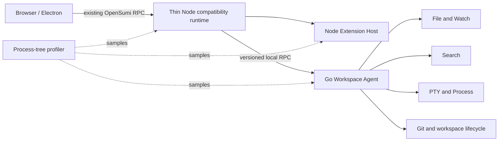

# OpenSumi Go Workspace Agent 测量驱动迁移方案

> 评审目标：在保持 OpenSumi 浏览器 RPC、VS Code Node 扩展兼容和现有 Node 产品入口不变的前提下，通过整棵进程树测量、版本化本地协议和逐服务替换，把已证明存在资源收益的 OS 职责迁入 Go Workspace Agent；本方案不批准一次性重写后端，也不在缺少基线时引入常驻 Go 双栈。

## 1. 评审结论与现状证据

当前最可维护的决策是先完成跨进程归因，再按收益门槛迁移。现有 Node 24 服务已经具备主进程堆/RSS readiness、WebSocket 连接边界、扩展宿主数量与堆上限、Watcher 堆上限以及连接回收冒烟；直接增加 Go 服务会重复此前“双栈存在但 Node RSS 不消失”的失败形态。

当前代码同时提供了渐进替换所需的边界：

- `server/src/start-server.ts` 的 `/healthz` 与 `/readyz` 仍以主 Node 进程的 `process.memoryUsage()` 决定 readiness，并额外返回不影响就绪判定的 Workspace Agent 运行诊断。
- `server/scripts/memory-smoke.ts` 原先只比较主进程连接前后的 RSS，不能归因 Extension Host、Watcher、PTY、语言服务器或其他子进程。
- `packages/core-node/src/connection.ts` 为每个客户端创建独立 `RPCServiceCenter` 与子 Injector，并在 channel 关闭时释放，浏览器协议可以保持不变。
- `packages/file-service/src/common/tokens.ts`、`packages/search/src/common/content-search.ts` 和 `packages/terminal-next/src/common/pty.ts` 已定义服务边界。
- `server/src/main.ts` 已支持把 PTY 管理器切换为 socket/TCP 远端实现，证明“Node adapter + 独立 OS 服务”能够在不修改浏览器的情况下落地。
- `packages/extension/src/common/ext.host.proxy.ts` 的进程代理和完整 VS Code 扩展 API 仍依赖 Node；这一兼容内核不进入 Go 重写范围。

由此可得：**Go 的引入单位应是一个有独立资源所有权的服务，不是目录、package 或整个后端。**

## 2. 目标、不变量与非目标

### 2.1 目标

1. 以同一工作负载记录主服务及全部后代进程的 RSS、角色、数量和 Linux cgroup 内存，能够判断增长属于哪个运行时。
2. 为候选 Go 服务建立版本、能力、取消、错误和健康契约；浏览器继续调用现有 OpenSumi RPC。
3. 每次只迁移一个资源所有者，允许关闭、影子读取、灰度启用和立即回退。
4. 只有 Go pilot 达到明确容量收益且功能等价，才进入默认路径。

### 2.2 不变量

- `/service`、OpenSumi RPC 序列化和浏览器 Service Path 保持兼容。
- Node `ServerApp`、DI/Contribution 装配和 VS Code Node Extension Host 保留。
- 文件写入、Git 修改和进程创建等副作用在任一时刻只有一个权威执行者。
- 现有 Node 实现始终是单模块迁移期间的回退路径，直到该模块完成独立发布验收。
- 密钥、Token、带凭证 URL 和文件内容不得进入进程诊断输出。

### 2.3 非目标

- 不一次性重写 `server/` 或 `packages/*/node`。
- 不用 Go 重新实现 VS Code Extension Host、浏览器状态、Monaco 或 Yjs 协议。
- 不为了证明方向而提交只有 `/health` 的空 Go 常驻进程。
- 不把主进程 RSS 下降等同于整棵工作区进程树内存下降。

## 3. 总体架构与关键决策



Node 继续拥有前端兼容和插件语义；Go 只拥有已经迁移的 OS 资源。诊断器从进程树与 cgroup 外部观察两侧，避免服务自己报告的 heap 指标掩盖 native memory、Buffer 或子进程成本。

| 决策点 | 选择 | 不选择 | 理由与代价 |
| --- | --- | --- | --- |
| 迁移方式 | 按服务绞杀式迁移 | 全量重写 | 保持协议与回滚边界；过渡期需要维护 adapter |
| 首个候选 | 测量后优先评估 File/Watch + Search | 预先指定必须迁移 | 两者已有取消/释放边界，但最终顺序由进程树数据决定 |
| 浏览器连接 | 继续连接 Node `/service` | 浏览器直接连接 Go | 不改公开协议、鉴权和会话语义；Node adapter 暂时保留一次转发 |
| 本地协议 | Protobuf 定义的版本化 RPC | 复制动态 TypeScript RPC | 支持 Go/TypeScript 代码生成、兼容检查、deadline 和 streaming |
| 副作用验证 | 单写；只对无副作用读取做影子比对 | Node/Go 双写 | 避免文件、Git、PTY 状态分叉；写路径只能灰度切换和回退 |
| Extension Host | 保留独立 Node 进程并限制资源 | Go 重写 | 第三方扩展依赖 Node/VS Code API；Go 只能负责编排和回收 |

## 4. Phase 0：整棵进程树观测契约

本阶段新增 `server/scripts/process-tree.ts` 作为跨平台采样核心：macOS/Linux 使用 `ps`，Windows 使用 CIM/PowerShell；Linux 额外读取 cgroup v2 的 `memory.current`、`memory.peak` 与 `memory.max`。输出中的常见凭证参数和 URL userinfo 在写出前脱敏。

每个 JSONL sample 使用以下稳定结构：

```ts
interface ProcessTreeMemorySnapshot {
  timestamp: string;
  rootPid: number;
  processCount: number;
  totalRssBytes: number;
  byRole: Record<ProcessRole, { count: number; rssBytes: number }>;
  processes: Array<{
    pid: number;
    parentPid: number;
    rssBytes: number;
    role: ProcessRole;
    commandLine: string; // 已脱敏
  }>;
  linuxCgroup?: {
    path: string;
    currentBytes?: number;
    peakBytes?: number;
    maxBytes?: number;
  };
}
```

`ProcessRole` 当前区分 `server`、`workspace-agent`、`workspace-agent-child`、`extension-host`、`extension-child`、`watcher-host`、`pty-host`、`terminal-shell`、`language-server`、`node-child` 和 `other`。已识别服务的未知后代会沿 PPID 归入对应 child 角色，例如 Extension Host 启动的 `git` 和 Agent 启动的辅助命令；语言服务器等已有明确语义的角色不被覆盖。角色只用于归因汇总；原始 PID/PPID/RSS 仍保留，未知进程不会因为分类缺失而从总量中消失。

三种入口覆盖不同场景：

1. `pnpm --dir server profile:runtime -- --pid <pid>` 附着到已有产品进程，持续输出 sample 和最终 summary，可用 `--variant`、`--sessions`、`--run` 标记同负载重复实验，用 `--output` 保存 JSONL。summary 包含整树、进程数和各角色的 P50/P95/peak。
2. `pnpm --dir server smoke:memory` 启动隔离服务并执行重复 WebSocket 连接周期，同时对主进程 `process.memoryUsage()` 和整棵进程树 RSS 设置独立回收门禁。
3. `pnpm --dir server compare:runtime` 默认要求 Node/Agent 各三份 JSONL，先计算每轮 P95/peak，再用跨轮中位数判断 25% 整树内存门禁；不同会话数或不等数量的输入会直接拒绝。

Linux cgroup 指标可能包含同一 cgroup 内的旁系进程，因此它用于验证容器总预算，`totalRssBytes` 用于当前 root 的后代归因；二者不能相互替代。

## 5. Go Agent 协议边界

本节已从协议提案落为可回退迁移。当前实现位于 `go/workspace-agent`，协议源位于 `packages/file-service/proto/opensumi/workspace/v1/workspace_agent.proto`，Node adapter 位于 `packages/file-service/src/node/workspace-agent.ts`。普通 Server 构建没有原生 Agent 制品时仍为 `off`；带当前平台原生启动证明、完整能力与有效摘要的生产包会自动启用已通过门禁的三个服务。

### 5.1 控制面与版本协商

Agent 启动后必须先完成能力协商，Node 不因“端口可连接”就切换业务流量：

```proto
service AgentControl {
  rpc GetCapabilities(GetCapabilitiesRequest) returns (GetCapabilitiesResponse);
  rpc Health(HealthRequest) returns (HealthResponse);
  rpc Shutdown(ShutdownRequest) returns (ShutdownResponse);
}

message GetCapabilitiesResponse {
  uint32 protocol_major = 1;
  uint32 protocol_minor = 2;
  repeated string services = 3;
  string build_revision = 4;
}
```

`protocol_major` 不一致时拒绝启用；minor 能力按 `services` 协商。Unix 默认使用权限为当前用户可读写的 Unix socket；Windows 使用仅绑定 loopback 的动态端口和一次性启动凭据。启动凭据只通过继承环境或受限文件传递，禁止进入命令行和日志。

### 5.2 业务服务规则

- 每个请求携带 workspace identity、deadline 和 trace identity；workspace 根目录由 Node 启动配置固定，浏览器不能任意覆盖。
- 取消必须传播到 ripgrep、Watcher 初始化、PTY 或 Git 子进程，客户端断线后不能继续占用资源。
- streaming 输出必须有有界队列和背压；超过上限时取消单请求，不拖垮 Agent。
- 错误使用稳定 code，Node adapter 转换为现有 OpenSumi 错误语义，禁止把 Go 内部路径或堆栈直接返回浏览器。
- File/Watch、Git、PTY 写操作不能做影子双写；影子模式只比较 stat、目录读取和搜索等无副作用结果。

## 6. 迁移顺序与收益门槛

### 6.1 候选资格

在相同机器、工作区、扩展集和操作脚本下执行至少三次 1/10/50 会话阶梯测试。一个模块只有同时满足以下条件才进入 Go pilot：

1. 其角色占整棵进程树稳态或峰值 RSS 的 20% 以上，或者在 100 次创建/销毁循环后仍表现出可重复的正增长斜率。
2. 已验证普通生命周期修复、上限和进程隔离不足以满足目标容量。
3. 服务拥有明确的取消、释放、错误和权限契约，不要求重写浏览器或 Extension Host。

20% 是进入开发的最低归因门槛，不是承诺的性能结果；它防止为一个边缘成本长期维护双语言实现。

### 6.2 推荐批次

| 批次 | 候选职责 | 进入条件 | 保持不变 |
| --- | --- | --- | --- |
| 0 | 进程树/cgroup 观测 | 立即实施 | 所有运行时行为 |
| 1 | File/Watch + Search | 数据证明 watcher/search 是主要成本 | `IFileService`、搜索 UI 与浏览器 RPC |
| 2 | PTY + Process | 终端工作负载达到候选资格，且跨平台契约测试完备 | xterm、Terminal Service Path、Extension API |
| 3 | Git + workspace lifecycle | 文件和进程所有权已稳定 | SCM UI、凭据策略、仓库内容 |
| 长期保留 | Extension Host、Node adapter、Yjs | 不进入 Go 重写 | VS Code 插件和协同协议 |

### 6.3 Pilot 成功门槛

在功能契约完全一致的前提下，Go pilot 至少满足一项容量收益，并同时满足回归门槛：

- 同一工作负载的整棵进程树 P95/峰值 RSS 降低至少 25%；或同一 cgroup 预算下可稳定承载的工作区数量提高至少 25%。
- 文件、搜索、终端或 Git 关键路径 P95 延迟不得回退超过 10%，取消后的资源必须在规定窗口内归零。
- 契约对比无结果差异、无孤儿进程/Watcher、无超出基线的凭据暴露。

未达到容量收益时删除 pilot，不以“Go 服务已经能运行”作为保留理由。

## 7. 灰度、失败和回滚

计划使用 `off`、`shadow-read`、`enabled` 三种模块级模式，而不是一个控制所有能力的总开关：

- `off`：Node 权威实现，Go 不启动。
- `shadow-read`：Node 返回结果；Go 仅执行允许影子的无副作用读取并记录结构化差异。
- `enabled`：Go 为该模块权威实现；Agent 不健康、版本不兼容或超过 deadline 时，未开始的请求可回退 Node，已经产生副作用的请求不得静默重放。

Agent 崩溃后 Node 必须回收 socket、请求和子进程句柄。当前 Watch 连接立即单向切到 Node，不能因为 Agent 恢复而静默切回；正在 streaming 的 Search 明确失败，不能把部分结果静默重放。后续请求使用 250/1000ms 的按需退避启动新 Agent，同一分钟内第三次失败后熔断到 Server 重启，避免无限重启和双份资源常驻。单项 capability 缺失只让对应服务回退，不能销毁仍在承担其他服务的健康 Agent。

现有 `/healthz` 与 `/readyz` 返回只读的 `workspaceAgent` 字段：配置模式、`idle/starting/running/restart-backoff/restart-ready/exhausted` 状态、PID、协商后的协议和服务、活动流/共享 Watch 数以及一分钟重启预算。该结构不包含 Bearer、Socket、二进制路径或命令行。`affectsReadiness` 固定为 `false`，因为 Agent 失败时 Node fallback 仍是受支持的兼容路径；只有原有 Node 内存门禁可以让 `/readyz` 返回 503。这样既能告警 Agent 降级，也不会因可恢复的子进程问题错误摘除整台 Server。

## 8. 安全与可观测性

| 风险 | 触发条件与影响 | 缓解 | 检测证据 |
| --- | --- | --- | --- |
| 诊断泄密 | Token 通过 CLI 参数或 Agent 子进程环境扩散 | 采样层统一脱敏；凭据只经启动环境传入 Agent，读取后立即从环境删除 | 脱敏单测、进程启动测试与 JSONL 抽检 |
| cgroup 误归因 | 多个工作区共享同一 cgroup | 同时保留 PID 树 RSS 与 cgroup 总量 | sample 中记录两类指标和 cgroup path |
| 双写分叉 | shadow 模式执行文件/Git/PTY 副作用 | shadow 只允许无副作用读取 | adapter 契约测试和审计日志 |
| 协议漂移 | Node 与 Go 版本独立发布 | major 拒绝、minor 能力协商、生成代码校验 | 启动日志与 capability 指标 |
| Agent 孤儿进程 | Node 异常退出或重启 | 父进程死亡检测、进程组/cgroup 回收 | 退出后 PID/Watcher/PTY 归零 |
| 假性内存收益 | 只比较 Node heap | 使用 process tree、cgroup、同负载三次重复 | 基线与 pilot JSONL 报告 |

## 9. 本阶段改动清单

| 文件 | 状态 | 职责 |
| --- | --- | --- |
| `server/scripts/process-tree.ts` | 本阶段新增 | 跨平台进程枚举、树选择、角色归因、脱敏和 cgroup 采样 |
| `server/scripts/process-tree.test.ts` | 本阶段新增 | 验证 POSIX/Windows 解析、树选择、分类、汇总与脱敏 |
| `server/scripts/profile-runtime.ts` | 本阶段新增 | 附着现有 PID，流式输出 JSONL sample/summary |
| `server/scripts/runtime-profile-metrics.ts` | 本阶段新增 | 计算整树/角色 P50、P95、peak 与跨轮中位数 |
| `server/scripts/compare-runtime-profiles.ts` | 本阶段新增 | 校验并对比至少三轮 Node/Agent 容量样本 |
| `server/scripts/package-workspace-agent.ts` | Pilot 新增 | 生成带 revision、平台和 SHA-256 manifest 的发布制品 |
| `server/scripts/memory-smoke.ts` | 本阶段调整 | 主进程与进程树双重基线、峰值、回收门禁 |
| `server/package.json` | 本阶段调整 | 暴露诊断、测试和现有内存冒烟命令 |
| `packages/extension/src/node/extension.service.ts` | 本阶段修复 | 断连回收不通知离线浏览器，通知失败不形成未处理拒绝 |
| `packages/extension/__tests__/node/extension-memory-lifecycle.test.ts` | 本阶段调整 | 覆盖断连回收参数和通知失败边界 |
| `server/README.md` | 本阶段调整 | 记录诊断入口与指标边界 |
| `docs/architecture/client-server-runtime.md` | 本阶段调整 | 将 Go 适用边界指向本迁移门槛 |

Phase 0 之后，重复真实浏览器工作负载达到候选门槛，仓库已新增 Go module、Proto、Node adapter、Watcher 接入与 Search 接入。它们属于后续 pilot，不改变上表所描述的 Phase 0 观测文件职责。

## 10. 验收计划

| 验收项 | 可观察验证 |
| --- | --- |
| 跨平台解析 | 输入 POSIX 与 Windows 单/多进程样本 → 输出 PID/PPID/RSS 与完整命令 → 自动测试通过 |
| 递归归因 | 构造 root、孙进程和旁系进程 → 只汇总 root 及后代 → 按角色 RSS 合计等于 tree total |
| 凭据保护 | 命令包含 `--api-key`、`--token=` 和 URL userinfo → JSON 输出只含 `[REDACTED]` |
| 附着采样 | 启动已知进程 → 执行 `profile:runtime` → 每个周期输出 sample，结束输出 baseline/peak/final/retained summary |
| 连接回收 | 隔离服务执行多轮 WebSocket 建连/关闭 → 主进程和进程树 retained RSS 分别受门禁约束 → 子进程明细可归因 |
| Linux 容器边界 | 在 cgroup v2 容器运行 → sample 同时出现 tree RSS 与可读取的 cgroup current/peak/max；非 Linux 不因字段缺失失败 |
| 迁移决策 | 完成同负载 1/10/50 会话数据 → 只有满足候选资格的服务进入 Go pilot → 报告保留原始 JSONL 和三次统计 |

### 10.1 当前 Phase 0 验证结果

2026-08-28 在 macOS/Node 24 上执行默认 `smoke:memory`：5 轮、每轮 100 个 WebSocket 连接全部完成；主进程 RSS 从 `104579072` bytes 到最终 `57786368` bytes，进程树 RSS 基线为 `109428736` bytes、峰值为 `119521280` bytes、最终为 `59195392` bytes，两项回收门禁均通过。采样还捕获了启动期短暂存在的 shell/Git 后代，证明统计没有把非 Node 子进程漏出总量。

该负载没有激活 Extension Host、Watcher、PTY 或语言服务器，因此结果只验证 Phase 0 工具和连接回收，**尚不足以选择首个 Go 候选模块**。下一项证据必须来自真实页面加载、文件树、搜索、终端与扩展激活工作负载。

### 10.2 真实浏览器工作负载与关闭回归

同日启动默认产品并使用真实 Chromium 加载 `http://127.0.0.1:8080`，页面标题为 `workspace — OpenSumi`，控制台为 0 error；随后打开搜索面板、执行一次工作区搜索，并在真实 PTY 中运行 `printf 'OPENSUMI_RUNTIME_PROFILE_OK\n'`，服务日志收到完整输出。120 秒采样得到进程树基线 `54935552` bytes、峰值 `382140416` bytes；各角色在各自峰值时分别为主服务 `125026304` bytes、Extension Host `176750592` bytes、Watcher `75120640` bytes，其他后代 `7028736` bytes。

关闭浏览器后，Watcher 与终端立即退出，Extension Host 按默认空闲窗口在约 60 秒后退出，进程树最终回到仅主服务 `65110016` bytes。首次关闭同时发现连接 RPC 已销毁后仍通知 `$processNotExist` 的竞态，日志出现 `Uncaught Exception`；本阶段已把断连/僵尸回收改为不通知已离线浏览器，并对仍在线通知的拒绝做边界捕获。使用 `EXTENSION_HOST_IDLE_TIMEOUT=1000` 重新执行真实页面打开/关闭，Extension Host 正常退出且不再出现该异常。

这次单样本只说明最大峰值来自必须保留的 Extension Host；Watcher 占整棵树峰值约 19.7%，单独看仍不足以进入 pilot。后续重复同一真实页面、搜索与终端负载时，Watcher 角色占比分别为 20.85%、21.41%、22.14% 和 31.20%，已连续越过 20% 的开发门槛，因此第一批 pilot 确定为 Watch + Search。该结论是进入开发的资格，不是默认启用或生产容量结论。

Phase 0 只证明观测与决策链可用。Go pilot 的完成必须另行通过对应服务的功能、性能、失败恢复和跨平台验收，不能由本阶段测试替代。

### 10.3 Watch + Search pilot 当前结果

当前 Agent 实现 `AgentControl`、`WorkspaceWatcher` 与 `WorkspaceSearch`。Node 启动随机凭据；macOS/Linux 使用权限为 `0600` 的 Unix socket，Windows 使用只允许 `127.0.0.1:0` 的临时监听并通过子进程 stdout 返回实际端口。适配器拒绝固定端口、非 loopback 地址和不匹配的 Unix 地址，随后做 major version 与 service capability 协商；浏览器仍只连接 Node `/service`。Agent 是 server-scoped 单例，浏览器连接关闭只取消自己的流，Node 服务停止时由 lifecycle contribution 优雅关闭 Agent；父进程异常退出时 Agent 也会自停。

Watcher 按平台隔离实现：macOS 使用固定 `github.com/fsnotify/fsevents@v0.2.0` 的原生递归 FSEvents，内部 canonical 路径再映射回用户工作区路径；Linux 使用 fsnotify/inotify，Windows 使用 fsnotify/`ReadDirectoryChangesW`，两者都由同一适配层递归注册目录。macOS 原 fsnotify/kqueue 版本在当前仓库的共享监听下仍占用 18,189 个 FD，切换 FSEvents 后同一真实页面稳定为 40 个 FD，Agent RSS 约 14.3–17.0 MiB。连续刷新三次后 PID 不变、FD 仍为 40，且没有启动 Node watcher 回退进程。原生 macOS 后端经带认证的真实 gRPC 流写入 20 个文件，最终 race test 的事件延迟 P50 为 `49.914208 ms`、P95 为 `51.892125 ms`，低于 `750 ms` 门禁；取消流后 Health 的 `active_watches` 回到 0。

Search 由 Agent 管理 ripgrep 子进程并传播取消。真实浏览器 `ServerApp` 搜索的 shadow-read 对比两次均为 Node 99、Agent 99、missing 0、extra 0；后续源码增加三个匹配后，`enabled` 主路径在 UI 返回 102 条结果。指定不存在的 Agent binary 时，Watcher 启动回退到 Node watcher，搜索也返回 102 条；运行中终止 Agent 后，当前连接自动启动 Node watcher，随后搜索仍返回 102 条。

已通过 Go race test、macOS FSEvents 真实临时目录事件与 gRPC 延迟/取消测试、Linux arm64 原生 inotify race test、Linux amd64/arm64 无 CGO 编译、Windows amd64 Agent 与测试二进制交叉编译、Go build/vet、File Service 与 Search TypeScript build，以及 Watcher/Search 定向 Jest。File Service 还验证了 50 个逻辑 workspace 会话只创建一个等价的上游 Agent Watch，最后一个订阅退出后才取消上游流；这证明多路复用契约，不等价于 50 个完整浏览器会话容量。仓库 CI 已增加 macOS/Ubuntu/Windows 原生 race test、vet、打包、manifest 和二进制启动门禁，Ubuntu 另做 Linux arm64 cross-build；本地交叉编译与容器证据仍不能替代真实远端 CI。发布脚本已在 macOS arm64 与 Linux arm64 生成生产二进制与 manifest，也已生成 Windows amd64 `.exe`、平台元数据和 SHA-256；Node 会在执行前验证协议、平台、文件名和摘要。macOS/Linux 的生产 `server/dist` 均已通过真实浏览器主路径，Windows 仍缺原生 CI 结果与真实产品浏览器验收，因此两个功能保持默认 `off`，不能据此宣称整个后端已完成 Go 重写。

### 10.4 1/10 会话容量结果与继续条件

2026-08-28 在同一台 16 GiB macOS arm64 主机、同一仓库、生产 Server、真实 Chromium 页面和相同 `ServerApp` 搜索负载下完成对照。每轮都从新 Server 与新浏览器上下文启动，页面准备后固定等待 20 秒，再以 1 秒间隔采样 8 次；Node 与 Agent 各执行三轮，比较每轮 P95 后的跨轮中位数。10 会话需要同时把 `MAX_EXTENSION_HOSTS` 与 `MAX_MANAGED_EXTENSION_PROCESSES` 设为 16，否则第二层 Extension Host Manager 的默认上限 8 会让后两个会话无法获得完整扩展宿主。

| 会话数 | Node 整树 P95 中位数 | Agent 整树 P95 中位数 | P95 降幅 | Watcher/Agent 角色 P95 中位数 | 25% 门禁 |
| ------ | -------------------: | --------------------: | -------: | ----------------------------: | -------- |
| 1      |        439,336,960 B |         365,477,888 B |   16.81% |   82,640,896 B / 17,219,584 B | 未通过   |
| 10     |      1,665,843,200 B |       1,215,643,648 B |   27.03% |  551,944,192 B / 15,384,576 B | 通过     |

10 会话的 Node 与 Agent 各 30 个页面样本（共 60 个）全部返回 `103 results found in 21 files`。三轮 Node 都有 10 个 watcher；Agent 方案由一个 server-scoped Agent 共享等价订阅，三轮没有 Node watcher 回退。结果证明收益会随同一 Server 上的会话数增长，但不证明单用户场景达到整树门禁。因此灰度应先面向多会话服务端，并继续保持默认 `off`。

同一页面路径另执行三轮 10 会话并发的 warm search 延迟对照，每轮 10 个 `ServerApp` 查询都等待最终 `104 results found in 21 files`，而不是首批 streaming 结果。Node 三轮 P95 为 `1012/1074/1043 ms`，Agent 为 `1093/863/895 ms`；跨轮中位数为 `1043 ms` 对 `895 ms`，Agent 改善 14.19%，通过“不得回退超过 10%”的 Search 门禁。该数字包含搜索 UI 的节流时间，适用于当前真实页面路径，不替代 gRPC/ripgrep 分段耗时，也不证明 Watcher 事件延迟。

仓库现提供 `pnpm profile:browser-runtime` 作为参数化的 1/10/50 真实浏览器容量入口。它按批次打开 Chromium 页面，在每个页面执行一次准备搜索和一次计时的 warm search，验证精确最终结果，采样完整 Server 子进程树，关闭浏览器后再记录一次回收快照。当前源码上的 10 会话入口实跑全部返回 `107 results found in 22 files`，warm search P50/P95 为 `1026/1032 ms`，整树 P95 为 `1,800,306,688 B`；关闭浏览器并等待 4 秒后只剩 Server 与单个 Workspace Agent，共 `232,603,648 B`，10 个 Extension Host 与 10 个终端 shell 均已退出。

这次自动化实跑同时暴露了持久终端在浏览器关闭后可无限保活的问题。现在 `TERMINAL_IDLE_TIMEOUT` 只负责断线重连窗口，随后持久终端获得默认 30 分钟的独立恢复租期；进入租期时立即释放旧浏览器拥有的回调，底层 PTY 仍可由同 session 恢复，租期到期则结束 PTY 并删除 session、数据缓存和剩余监听。单元测试覆盖到期与恢复竞态，真实浏览器通过把终端与 Extension Host 回收窗口都缩短到 1 秒验证了上述 10 会话收尾结果；释放旧回调后的最终单会话复测也只剩 Server 与 Agent，收尾 RSS 为 `183,517,184 B`。默认 30 分钟仍保留产品的终端恢复语义。

这台主机在先前 10 个完整浏览器会话对照中最低只剩约 35% 系统空闲内存，直接扩展到 50 个完整 Chromium + Extension Host 会话没有安全余量；本轮没有伪造一个轻量连接测试替代产品容量结论。容量入口支持 `--sessions 50`，但必须在更大内存的隔离主机或容器集群上对 Node/Agent 各执行三轮，并保留 cgroup 与进程树两套指标。三轮 50 会话、远端 Ubuntu/Windows 原生 CI 和发布矩阵通过前，Pilot 仍不进入默认路径。

当前数据也不支持立即迁移 PTY：10 会话 Node 侧 `terminal-shell` P95 中位数仅 18,513,920 B，远低于 20% 候选资格；主要剩余成本是必须保留的 Extension Host。下一阶段应先完成现有 Watch/Search Pilot 的 50 会话和发布矩阵，而不是为了扩大 Go 代码量迁移一个尚未证明有收益的服务。

### 10.5 Linux arm64 原生与产品链路

2026-08-28 在 Docker Desktop 提供的 Linux `6.12.76` arm64 内核上执行 `pnpm test:workspace-agent:linux`。容器使用 Linux Go 工具链和 race detector，真实 inotify 的 20 个文件事件 P50 为 `49.523292 ms`、P95 为 `56.362958 ms`，取消后 `active_watches` 回到 0；同轮 `go vet`、native build 和二进制 `--help` 均通过。进程级测试直接运行 Unix listener，验证 Socket 权限 `0600`、未鉴权 RPC 被拒绝、协议与服务能力、授权 Shutdown、Socket 删除，以及配置的父 PID 消失后 Agent 在约 1 秒内退出。

随后在隔离容器中使用 Linux Node `24.18.1`、Linux 原生 `node-pty`、`nsfw`、`@parcel/watcher`、`keytar`、`@vscode/spdlog` 和 ripgrep 构建生产 Server 与 Linux arm64 Agent manifest。宿主真实 Chromium 打开容器 Server 后标题为 `workspace — OpenSumi`，Agent Search 最终返回 `164 results found in 41 files`。在真实 Linux PTY 中写入 `/workspace/linux-watch-proof.txt` 后，Explorer 通过 inotify 流立即出现同名文件。运行期只有一个约 21 MiB 的 Agent、Socket 为 `0600`、FD 数为 82，未启动 `watcher.process.js` 回退。

关闭浏览器并等待 4 秒后，Linux Extension Host 与终端 shell 均退出，只剩约 93 MiB 的 Node Server 和约 21 MiB 的 Agent；向 Server 发送 `SIGTERM` 后，两者与 Agent Socket 一并归零。该结果证明 Linux arm64 的产品主路径与生命周期，不等价于 Ubuntu amd64 远端 CI，也不是 50 会话容量结果。

### 10.6 Windows 传输、打包与待验收边界

Windows 不再复用 Unix Socket，也不使用固定 TCP 端口。Node 以 `--tcp 127.0.0.1:0` 启动 Agent，Agent 只接受 loopback 与端口 0，监听成功后把随机实际端口作为单行 JSON 写回继承的 stdout。Node 只接受 `tcp-loopback` 且形如 `127.0.0.1:<1..65535>` 的公告，再建立 gRPC 通道；每个 RPC 仍必须携带 256-bit 随机 Bearer。通用进程测试已经在当前主机上实跑该链路，覆盖随机端口分配、公告、未鉴权拒绝、协议能力和授权 Shutdown。Windows 父进程检测改用 `OpenProcess(SYNCHRONIZE)` 与零等待句柄状态，避免把 Unix `signal(0)` 语义错误搬到 Windows。

Node 适配器现在解析 `workspace-agent.exe`，打包器支持 `windows/amd64`、强制 `.exe` 后缀并生成平台与 SHA-256 manifest。发布契约明确区分 Node 的 `win32` 与 Go manifest 的 `windows`，并在校验时做显式映射；生产环境缺失 manifest、字段结构异常、协议/平台/文件名不匹配或摘要不一致都会在执行二进制前失败并保留 Node 权威实现，开发环境仍允许直接运行未打包二进制。本地已成功交叉生成 Windows amd64 Agent 及 cmd/internal 两个测试二进制；这证明源码与测试可链接，不证明 Windows 运行时行为。CI 矩阵已加入 `windows-latest`，会原生执行 race suite、`ReadDirectoryChangesW` 文件事件、父进程句柄测试、vet、生产打包和二进制 `--help`。只有该远端任务实际通过并完成 Windows 真实浏览器 Search/Watch/退出链路后，Windows 才能记为产品验收通过。

上述契约修复后重新构建 File Service，并以 revision `contract-20260828` 重新打包 macOS arm64 生产 Agent；`product-smoke-manifest-contract-darwin-r2.json` 在编译产物已包含新校验逻辑的前提下通过。初始 Search 为 `2/2`、`366 ms`，Agent Watch add/delete 为 `445/340 ms`；三次主动结束 Agent 后仍精确进入 `exhausted`，Node Search 为 `3/3`、`26 ms`，浏览器关闭 `2,098 ms` 后只剩 Server，随后 Agent/端口归零，unexpected console/page error 为 0。另一次 `windows/amd64` 交叉打包确认 manifest 使用 `windows`、二进制为 `.exe` 且 SHA-256 匹配；`nativeStartupVerified: false` 明确表明该交叉制品没有冒充 Windows 原生启动证据。

安全复核还确认 Go `exec.CommandContext` 默认会把 Agent 环境完整继承给 ripgrep。Agent 现在读取 Bearer 后、开放监听前立即删除 `OPENSUMI_AGENT_TOKEN`；Search 创建子进程时再次按大小写不敏感规则构造无凭据环境，兼顾当前独立进程入口与未来嵌入式调用。跨平台进程测试证明环境变量删除后既能拒绝未鉴权请求，也能继续用内存中的原凭据完成授权 Shutdown；Go race/vet 通过。以 revision `token-boundary-20260828` 重新打包后的产品门禁也通过：Search `384 ms`、Watch add/delete `454/362 ms`、exhausted 后 Node Search 仍为精确 `3/3`，浏览器关闭 `2,054 ms` 后子进程归零，unexpected console/page error 为 0。

同一轮内存边界复核还发现 Search 曾把 ripgrep stderr 无界收集到 `strings.Builder`，并允许最多 128 条、每条扫描上限 16 MiB 的结果进入同一批次；极端长行与重复 submatch 可能在单次 gRPC Send 前占用 GB 级内存。现在 stderr 直接流向 `io.Discard`，JSON token 上限收紧到 2 MiB，事件在 128 条或估算 256 KiB 时提前 flush，单个超过批次预算但仍在扫描上限内的结果独立发送。这样每个活动搜索的缓冲由明确常量约束，不依赖常见代码行较短这一经验假设。

以 revision `bounded-search-20260828` 重新打包后的 macOS arm64 制品（SHA-256 `290d8d47f8cd85dfa9570d27dc3e1dc55b1a3d4d12c7c908a27192d2ab2b76bd`）连续执行完整产品门禁时，首次运行的初始 Search 在 60 秒超时，页面与 Server 没有同时报告 console/page error，清理也没有残留进程；同一二进制、同一源码的随后两次聚焦复跑均通过，初始 Search 为 `527/625 ms`，Agent Watch add/delete 为 `395/360 ms` 与 `482/350 ms`，exhausted 后 Node Search 为 `21/24 ms`，浏览器关闭为 `2,036/2,095 ms`，两轮 unexpected console/page error 均为 0，Agent 与端口都回收。该结果没有复现内存边界导致的稳定回归，但首次超时仍作为孤立抖动保留在证据中，不能写成三轮全绿。

Watch 的长期运行复核随后发现另一条背压缺口：待发送 map 虽已限制为 4,096 条，但 macOS FSEvents 与 Linux/Windows fsnotify backend 向前置 256 槽 channel 的写入仍会阻塞。慢 gRPC 消费者因此会停止原生回调或 OS 事件 drain，把压力推回内核队列。两个 backend 现在共用有界非阻塞队列，满载时只递增原子 overflow 计数，Watch RPC 在下一次 50 ms flush 中通过已有 `WatcherOverflow` 上报；每流 coalescing map 另受估算 1 MiB 编码体积上限约束，长路径不能把单次 protobuf 推近默认 gRPC 消息上限。满 map 中已有路径仍可更新最终事件类型，不再被误记为新丢失。控制面也让父进程 monitor 支持同步停止，并在 `GracefulStop` 超时强制 `Stop` 后等待 goroutine 真正返回，消除仅靠进程退出回收 ticker 的隐含前提。

最终 macOS arm64 revision `bounded-watch-v2-20260828` 的 SHA-256 为 `cf99a30e8ed4066f51f97251f4919ca7aeada04ed757551ebd8b8a7d9d17f8ac`。旧 schema 4 门禁首次运行再次在初始 Search 超时，失败 DOM 明确显示 Search 视图仍可见但输入已被启动期重挂载清空，Server 日志只有 listen、console/page error 为 0，说明请求没有保持到后端而不是 Go Search 阻塞。schema 5 因此在同一个 60 秒总预算内检测输入重置并重新提交，同时把次数写入 `inputResetRetries`；输入仍在但结果不完成时不会延长截止时间。改造后同一最终制品连续四轮完整门禁通过，初始 Search 为 `548/817/443/497 ms`，Agent Watch add/delete 为 `445/369`、`523/367`、`510/331`、`513/378 ms`，第二次恢复 Search 为 `898/900/895/899 ms`，exhausted 后 Node Search 为 `23/24/19/26 ms`；四轮所有 Search 的 `inputResetRetries` 都是 0，unexpected console/page error 为 0，浏览器关闭 `2,087/2,022/2,098/2,035 ms` 后子进程、Agent 和端口全部回收。此前两次输入清空失败仍保留，不能由后续四轮通过抹去。

为避免只验证内部 queue 而没有验证协议出口，Watch 的路径校验/平台 backend 构造与事件循环现已解耦；确定性假 backend 在 race 下重复 100 次，均把 7 个 backend drop 合并成下一次 flush 的单个 `WatcherOverflow(event_count=7)`，随后取消流并把 `activeWatches` 精确归零。包含该服务级测试的最终 macOS arm64 revision `watch-overflow-e2e-20260828`（SHA-256 `560a560277902961601f82fcb814a65ced37ab400e42c27dbe8cfde46bf3c15b`）重新通过完整产品门禁：Search `685 ms`、Agent Watch add/delete `375/508 ms`、第二次恢复 Search `880 ms`、exhausted 后 Node Search `41 ms`、浏览器关闭 `2,128 ms`，input reset、unexpected console error 与 page error 均为 0，Agent/端口全部回收。最终源码还重新完成 Linux amd64、Linux arm64、Windows amd64 目标链接；尝试刷新 Linux 原生容器证据时，本机 Docker Desktop socket 对 API v1.54 和显式降级的 v1.43 都返回 HTTP 500，另一次 daemon 请求无响应，因此容器根本没有进入源码测试阶段。没有擅自重启用户 Docker，也没有把交叉链接写成 Linux 原生通过；该项仍等待可用 daemon 或远端 CI。

Node-Go 适配层的常驻生命周期复核又修复了四个小而可累积的保留点：启动握手不再无限拼接没有换行的 stdout，单条 ready announcement 在 64 KiB 失败并移除 stdout/exit/error 监听；`waitForExit` 超时会卸载自己的 `exit` listener；严格顺序的 launch attempt 用单个最大已处理编号去重，不再用随运行时间增长的 `Set` 保存所有失败编号；显式取消 Search 或释放最后一个共享 Watch 时先同步 untrack，再调用 grpc-js `cancel()`，不再假设库一定补发 `error/end` 才能从诊断集合移除。18 个定向测试在不带仓库 `--forceExit`、启用 `--detectOpenHandles` 时自然退出，File Service/Watcher/Search 三套相关 Jest 共 25 项通过，File Service build 通过。最新 macOS 产品链再次完整通过：初始 Search `640 ms`、Agent Watch add/delete `518/368 ms`、恢复 Search `113 ms`、第二次恢复 `898 ms`、exhausted 后 Node Search `26 ms`，浏览器关闭 `2,043 ms` 后所有后代、Agent 与端口回收，input reset、unexpected console error 和 page error 均为 0。

启动握手改造后还重新构建了 macOS arm64 生产 Server 与 manifest，并用真实 Chromium 回归 Unix 主路径。页面标题为 `opensumi — OpenSumi`，Agent Search 对 `workspace-agent-ready` 返回 `6 results found in 4 files`；真实 PTY 创建 `workspace-agent-handshake-proof.txt` 后 Explorer 立即出现该文件。运行期 Socket 仍为 `0600`、只有一个约 17 MiB Agent 且没有 `watcher.process.js`；关闭浏览器 5 秒后只剩 Server 与 Agent，终止 Server 后二者、Socket 和 8000/8080 监听全部清理。浏览器仍有一个来自现有 GitHD 扩展空数据视图的 console error，与本次 Agent 路径无关，未把它误记为 0 error。

仓库现新增 `pnpm smoke:workspace-agent:product`，把 Linux/Windows 的真实产品验收变成可重复门禁。它从生产 `client/dist` 与 `server/dist` 启动临时工作区，真实 Chromium 必须得到精确的 `2 results found in 2 files`，Explorer 必须观察到新增和删除事件；进程树必须只有一个使用当前平台传输的 Agent、没有 Node watcher 回退。随后脚本主动结束 Agent：已有 Watch 必须收敛为一个 Node watcher，新的 Search 必须在有界退避后由不同 PID 的 Agent 返回精确结果，Node fallback 还必须继续把 add/delete 事件映射到浏览器最初请求的 workspace 路径。浏览器关闭后 fallback watcher、Extension Host、PTY 与 shell 必须退出，Server 停止后重启的 Agent PID 与监听端口也必须归零。`ubuntu-latest` 与 `windows-2025` 都会显式构建生产客户端、服务端和原生 Agent，执行该门禁并分别上传 JSON 与截图；独立原生矩阵还会保留 macOS、Linux、Windows 各自通过 manifest/摘要/启动校验的二进制包，便于直接检查实际 CI 制品。

同一脚本已在 macOS arm64 实跑通过：Search 为 `2/2`，Watch 新增/删除延迟分别为 `371/365 ms`；运行期一个 Agent RSS 为 `17,580,032 B`，浏览器关闭后 `2,057 ms` 内只剩 Server 与同一 Agent PID，Server `SIGTERM` 为正常退出且 Agent/端口均回收，console/page error 均为 0。该结果验证门禁脚本和 Unix 产品路径；远端 Windows 产品结果仍必须以实际 CI run 为准，不能在 CI 尚未执行时记为 Windows 验收通过。

崩溃恢复门禁随后在同一平台连续两次通过：初始 Search 均为 `2 results found in 2 files`，耗时 `381/382 ms`，Agent Watch add/delete 为 `370/338 ms` 与 `355/365 ms`。主动结束首个 Agent 后，当前连接都只启动一个 Node watcher，恢复 Search 分别在 `97/87 ms` 内由不同的新 PID 返回 `1 results found in 1 files`。首轮调试同时发现 Node watcher 会把临时目录的 `/var/...` 事件规范化为 `/private/var/...`，导致 Explorer 丢弃 fallback 事件；现在递归 watcher 按最长真实根映射回原始请求根，修复后两轮 Node fallback add/delete 为 `433/492 ms` 与 `432/484 ms`。浏览器关闭 `2,083/2,098 ms` 后都只剩 Server 与新 Agent，fallback watcher、Extension Host、PTY/shell 全部退出；Server 正常退出后新 Agent 与端口归零。唯一 browser error 是脚本明确要求且精确匹配的“已切换到 Node watcher”恢复通知，unexpected console/page error 均为 0。

运行诊断和完整重启预算随后由 `output/workspace-agent/product-smoke-exhaustion-darwin.json`（schema 4）及对应截图实跑通过。初始 Search 为 `2/2`、`378 ms`，Agent Watch add/delete 为 `379/344 ms`。首次结束 Agent 后 `/readyz` 保持 HTTP 200/`ready: true`，同时准确报告 `restart-backoff`、`degraded: true`、失败次数 1、PID 缺失和流数归零；恢复 Search 在 `115 ms` 内由第二个 PID 返回 `1/1`，Node fallback Watch add/delete 为 `439/489 ms`。第二次结束 Agent 后诊断报告失败次数 2，下一次 Search 经过长退避在 `902 ms` 内由第三个唯一 PID 返回 `2/2`。第三次结束 Agent 后状态固定为 `exhausted`、失败次数 3；随后精确的 `3/3` Search 在 `24 ms` 内由 Node 完成，进程树仍为 0 Agent/1 Node watcher，没有第四次拉起。浏览器关闭 `2,057 ms` 后只剩 Server，诊断中的活动流与共享 Watch 都为 0；Server 正常退出后端口归零。唯一 browser error 仍是预期的首次 Watch fallback 通知，unexpected console/page error 为 0。

重复门禁时还复现了一个独立的前端搜索竞态：输入框 `fill` 会排队 300ms 的 search-on-type，用户紧接着按 Enter 又会立即搜索；长退避恰好让尾随调用取消显式请求，页面错误显示 0 结果。现在显式 `search()` 会先取消未触发的 debounce，服务销毁也会取消计时器，既避免陈旧请求也不让 timer 闭包延长对象生命周期。重新构建生产客户端后，完整三次崩溃门禁连续三轮通过：第二次恢复 Search 为 `904/891/900 ms`，exhausted 后 Node Search 为 `21/19/17 ms`，浏览器关闭为 `2,030/2,051/2,064 ms`；三轮都是三个唯一 Agent PID、无第四次拉起、unexpected console/page error 为 0。

### 10.7 50 会话容量编排与安全门禁

仓库现提供 `pnpm capacity:workspace-agent`。该入口每轮都启动新的生产 Server，按 Node → Agent 交替顺序各执行三轮，避免把温度、文件缓存或机器压力的时间偏移全部归给某一侧。每个浏览器会话先后执行 warm 和 measured Content Search、warm 和 measured Quick Open File Search；File Search 必须出现调用方给定的精确文件名，Agent 轮明确启用 Watch/Search/File Search，Node 轮则全部关闭。每个 sample 不仅要有页面，还必须出现与会话数相同的 Extension Host 和终端 shell；Node 基线必须是每会话一个 watcher，Agent 侧必须只有一个稳定 PID 且 Node watcher 为 0。任一 console/page error、两类搜索结果不一致、watcher 回退、浏览器关闭后残留子进程或 Server 停止后 Agent/端口未归零，都会使当轮失败。

对比报告现同时计算整树 P95/峰值的 25% 内存门禁、Content Search P95 的 10% 回退门禁和 File Search P95 的独立 10% 回退门禁。旧 JSONL 如果只有内存 sample，或缺少任一搜索延迟事件，仍可生成已有维度的比较，但缺失项会明确记为 `evidenceAvailable: false` 且不通过总验收，避免历史数据被误报为完整证据。已完成且重新校验通过的轮次可以用 `--resume` 复用；不完整文件会自动重跑。`SIGINT` 中断实跑已验证会回收 Server、Chromium 与后代进程，并保留 `failed` 状态供续跑。

完整编排已在 macOS arm64 以 1 会话、Node/Agent 各 1 轮实跑，两轮都通过全产品进程数、搜索、回收和 Server 退出验证；Search P95 为 `66/70 ms`，回退约 6.06%，通过延迟门禁。单会话内存未达 25% 的旧结论不变，所以该轮只标记 `smoke-passed`，不是容量资格。默认 50 会话预检需要至少 40 GiB 有效可用内存（同时考虑 host 和 Linux cgroup 上限）；`--preflight-only` 会先写入独立的 `capacity-preflight.json`，再对不足内存返回失败，因此机器不达标时也有可审计证据。

File Search 接入后又以 macOS arm64 真实生产 Server/Chromium 执行了一轮 1 会话 Node/Agent 对照。两轮都完成精确的 `1 results found in 1 files` Content Search 和 `workspace_agent.proto` Quick Open，且进程角色、浏览器关闭和 Server 退出验证全部通过。Content Search P95 为 `68/72 ms`（Agent 回退 `5.88%`），File Search P95 为 `27/27 ms`，两个 10% 延迟门禁均通过；Agent 整树 P95 反而高 `9.91%`，所以内存门禁失败。这只是证明新增工作负载、比较字段和资格逻辑端到端可执行，仍是 `smoke-passed`，不能作为 50 会话容量结论。旧 Search-only JSONL 也已复核为 `fileSearch.evidenceAvailable: false`、总资格失败。

仓库同时提供手动触发的 `Workspace Agent capacity qualification` 工作流。它只匹配带 `self-hosted`、`linux`、`x64`、`workspace-agent-capacity` 四个标签的专用 runner，并在安装依赖前再次执行 40 GiB 硬预检；标签用于路由，实际 host/cgroup 可用内存才是资格依据。工作流把负载固定为 50 会话、Node/Agent 各三轮，不暴露低内存绕过参数，要求触发者填写精确 Content Search 结果以及 Quick Open 查询/文件名，并为每个 run attempt 使用独立目录。无论成功还是失败，预检、六轮原始 JSONL、Server 日志、suite 状态和对比报告都会作为 artifact 保留 30 天。最终 50×3×2 数据仍等待满足标签和内存条件的隔离容量机，不能由本机 smoke 或仅有标签的低内存 runner 替代。

### 10.8 当前源码的因果拆分与迁移决策

用户将优先级调整为先证明功能和实际收益后，2026-08-28 又在同一台 macOS arm64 主机上使用 revision `causal-performance-20260828` 对当前源码执行了一会话、Node/Agent 交替、每侧三轮的生产 Server + 真实 Chromium 对照。六轮 Search 都精确返回 `1 results found in 1 files`，每轮采样期间都保持一个 Extension Host、一个终端 shell，以及对应的一个 Node watcher 或一个 Agent；浏览器关闭后业务子进程全部回收。六轮都观察到现有 GitHD 空数据视图的精确消息 `Displaying error: No data available for the selected range`，脚本现在把这一个已知非工作负载 console error 单独留证；其余 unexpected console/page error 为 0。错误明细限制为 50 条、单条 2 KiB，后置 warmup/采样阶段的错误也写入 summary 并由容量编排和独立 comparison 入口共同拒绝，不再只检查 Search 完成瞬间的计数。

当前三轮中位数为 Node 整树 P95 `200,327,168 B`、Agent `159,793,152 B`，降低 `20.23%`；对应长期 Watch 角色由 Node watcher `56,688,640 B` 变成 Agent `14,090,240 B`，减少 `42,598,400 B`（`75.14%`）。由于内存采样发生在 Search 已完成、ripgrep 子进程已经退出之后，单会话这约 40.5 MiB 的整树差值可以主要归因于常驻 Watch 执行面替换，而不是把短命 ripgrep 内存算给 Go。此前 10 会话的 27.03% 整树降幅还额外包含“十个 watcher 合并为一个 Agent”的多路复用收益；因此不能把全部多会话收益都归因于语言，但单会话角色数据仍证明 Go runtime/native watcher 本身比一个 Node watcher 进程轻约 42.6 MiB。

Search 的结论不同。Node 与 Go 都启动同一个 ripgrep，差异主要是 JSON 解析、批处理和 gRPC 转发，不存在换成 Go 就自动获得更快搜索算法。当前三轮 warm Search P95 为 Node `73/74/69 ms`、Agent `81/83/75 ms`，跨轮中位数 `73 ms` 对 `81 ms`，Agent 回退 `10.96%`，略超允许的 10% 门槛；先前十会话中 Agent 改善 14.19%，说明并发摊销和 UI 时序会改变结果，不能用其中任一组覆盖另一组。Go Search 现新增确定性服务级测试，覆盖 Unicode byte offset 原样传输、`max_results`/`limit_hit`、取消子进程以及 `activeSearches` 归零，但功能正确不等于性能已获准。

该 revision 当时的 go/no-go 决策是：Watch 在 macOS/Linux 多会话 pilot 中可继续使用 `enabled`，它已同时证明功能、生命周期和常驻内存收益；Search 暂时保持 `shadow-read` 或 `off`；PTY 不迁移，Git/文件 CRUD 也不因“扩大 Go 覆盖面”直接开工，必须先证明其常驻或并发成本达到候选阈值。Node 继续承担公开 RPC、Extension Host 和兼容控制面，Go 只接收已证明适合的 OS 数据面职责。原始证据位于 `output/runtime-profiles/causal-s1-r3-20260828`；Search 的后续当前源码复测见 10.11。

### 10.9 公共 WebSocket Go 化实验与否定性结论

公共 `/service` 已完成一个默认关闭的 Go Gateway 实验。浏览器协议、Fury payload 和 RPC channel 语义保持不变：Go 接管 HTTP upgrade、payload 上限、连接上限、ping/pong、写超时和慢客户端背压，并把每条二进制消息转换成现有 Electron transport 使用的 `\r\n\r\n + uint32LE length + payload` 帧；Node 只监听随机 loopback HTTP 和权限为 `0600` 的私有 Unix channel。Gateway 在接受连接前查询 Node `/readyz`，所以原有内存压力 admission gate 仍然生效。生产制品包含独立的 `ws-gateway` manifest、目标平台、revision、启动校验和 SHA-256；`OPENSUMI_WS_GATEWAY_MODE=enabled` 是唯一启用入口，默认仍由 Node 直接监听公网端口。

真实产品功能链在 macOS arm64 上通过：公网 `18080` 的监听者确认为 Go，Node HTTP 只监听随机 `127.0.0.1` 端口；真实浏览器标题为 `workspace — OpenSumi`，同一连接完成 RPCService、DiskFileService、Watcher、PTY 与 Extension Host 初始化。Node 日志观察到物理连接对应的 channel open；关闭与 Server `SIGINT` 后 RPC、Gateway、私有 Socket 和公网端口均回收。原生流还增加“Writable 已 destroyed/closed 后不得发送关闭帧”的回归断言，避免网关先断开时出现 `EPIPE`。

功能成立不代表容量收益。仓库新增 `pnpm profile:ws-gateway`，每轮启动新的 production Server，由 Server 进程树之外的客户端建立相同数量的空闲 `/service` WebSocket，交叉执行 Node/Gateway 顺序并记录握手 P50/P95、连接前基线、连接期整树 P95、角色 RSS 与关闭后快照。200 连接、每侧三轮的结果如下：

| 指标                |       Node 直连 |      Go Gateway | Gateway 相对变化 |
| ------------------- | --------------: | --------------: | ---------------: |
| 握手 P95 跨轮中位数 |      `4.976 ms` |      `7.887 ms` |    回退 `58.51%` |
| 整树 P95 跨轮中位数 | `120,717,312 B` | `154,615,808 B` |    增加 `28.08%` |
| 连接增量 RSS 中位数 |   `1,048,576 B` |  `15,597,568 B` |      多 `13.88×` |

三轮 Gateway 的主要固定成本是约 `9–12 MiB` Go 进程，200 个连接又把 Gateway 角色推到约 `16–24 MiB`；Node 的事件循环和 `ws` 对空闲连接本来就很轻。当前实现还为每个浏览器连接保留一个 Node 私有 socket 和双向转发协程，所以增加了一跳、两套 socket 与额外调度。该结果明确未通过“延迟不得回退超过 10%”和“整树 RSS 必须下降”两项门禁；原始证据为 `output/runtime-profiles/ws-gateway-c200-r3.json`。

因此 WS Gateway **不得默认启用，也不能作为降低内存的已批准迁移**。继续研究只能从结构上消除重复所有权，例如把多条浏览器连接复用到单一 Node transport，或者等 RPC/会话服务本身迁出 Node 后取消回跳；只把 WebSocket termination 换成 Go 不成立。后续任何优化都必须重跑同一三轮门禁；未同时改善整树 RSS和 P95 延迟前，生产架构仍以 Node 公共 WebSocket 为准。这也是当前最重要的结论：Go 对 native Watcher 有实测收益，但对事件循环型空闲 WebSocket 并不天然更省内存。

随后在当前默认 512 连接上限附近补做 500 连接、每侧三轮实验，确认旧结果不是因为连接数太少。优化前 Node/Gateway 握手 P95 跨轮中位数为 `12.671/18.512 ms`，Gateway 回退 `46.10%`；整树 P95 为 `109,903,872/142,016,512 B`，Gateway 高 `29.22%`。逐连接增量 RSS只显示 Gateway 约 `4.39%` 的微弱改善，无法抵消额外 Go runtime、私有 socket 和转发层的固定成本。原始证据为 `output/runtime-profiles/ws-gateway-c500-r3-20260828.json`。

握手路径复核发现每个并发连接都会单独请求 Node `/readyz`，这与 Node 直连的进程内 admission check 不等价。Gateway 现把同时发生的 admission 合并为一个请求，并只在 100 ms 有界窗口内复用结果；失败结果同样有界，关闭 Gateway 会取消正在共享的检查，避免为了合并而留下最长 5 秒的后台请求。race 测试覆盖 32 个并发调用只产生一次 Node 请求、缓存到期后重新检查，以及 Shutdown 立即取消 in-flight admission。

同一 500 连接、三轮负载复测后，Gateway 握手 P95 中位数降到 `9.187 ms`，Node 为 `11.814 ms`，Gateway 改善 `22.23%`，延迟门禁已通过；Gateway 自身整树 P95 也从优化前的 `142,016,512 B` 降到 `125,927,424 B`。但是同轮 Node 为 `109,281,280 B`，Gateway 仍高 `15.23%`，所以总资格继续失败、默认开关继续为 `off`。该结果把问题进一步收敛为结构性重复所有权，而不是握手实现细节；原始证据为 `output/runtime-profiles/ws-gateway-admission-cache-c500-r3-20260828.json`。

结构性复用随后落地为私有 `multiplex-v1` 协议：浏览器和公开 `/service` 完全不变，Go 用 `OPEN/DATA/CLOSE + stream id` 把所有浏览器逻辑流复用到一个 Gateway→Node Unix/TCP transport；Node 为每个 `OPEN` 恢复独立 `IConnectionShape`，继续进入原有 Fury serializer、`BaseCommonChannelHandler`、RPCServiceCenter 和 child Injector。旧 `direct` 模式保留为显式回退，`OPENSUMI_WS_GATEWAY_CHANNEL_MODE` 和 profiler 的 `--gateway-channel-mode` 必须让两端选择同一协议。私有 transport 有 32 MiB 单消息限制、每逻辑流 16 MiB 排队上限、物理输出总上限、未知 stream/坏 preface/坏 frame fail-closed，以及物理关闭时全逻辑流回收。

协议实现没有只依赖类型检查。Go race 集成测试证明两个公网 WebSocket 共用一个 Node 物理连接、stream id 隔离、突发多帧顺序正确、浏览器关闭发送逻辑 `CLOSE` 且 Shutdown 回收物理 transport；测试中还实际发现旧桥接层会把 8 字节长度头和 payload 分成两次 `Write`，复用流因此补齐了真正的 `net.Conn` 拆包/粘包语义。Node Jest 使用真实 TCP、分片 preface 和两个 Fury/RPC `WSChannelHandler`，证明关闭一个逻辑连接后另一个仍能继续调用。最终打包二进制的完整 production Chromium 门禁也通过：Search `645 ms`、Quick Open `26 ms` 并打开目标文件、Watch add/delete `505/341 ms`，三次 Agent 故障后的恢复/Node fallback、浏览器子进程和 Server/Gateway/端口清理全部成功；`/readyz` 明确报告 `channelMode: multiplex-v1`。证据为 `output/workspace-agent/product-smoke-ws-multiplex-final-darwin.json` 及对应截图。

500 个空闲连接、Node/Gateway 各三轮的复用结果为：Node/Gateway 握手 P95 中位数 `2.729/2.676 ms`，Gateway 快 `1.95%`，延迟门禁通过；整树 P95 为 `93,274,112/120,586,240 B`，Gateway 仍高 `29.28%`，内存门禁失败。当前同代码另跑的 `direct` Gateway 为 `8.464 ms`、`122,437,632 B`；跨两组实验看，复用把 Gateway 握手 P95 降低约 `68.39%`，但 Gateway 整树 RSS 只低约 `1.51%`。两组 fresh-process 基线在 `51–141 MB` 间明显波动，不能把这 1.51% 当稳定内存收益；资格判定仍只看各自与同组 Node 的三轮中位数。原始证据为 `output/runtime-profiles/ws-gateway-multiplex-c500-r3-20260828.json` 和 `output/runtime-profiles/ws-gateway-direct-current-c500-r3-20260828.json`。

因此，单物理 transport 已消除“每浏览器再建一个 Node socket”的结构性重复和 direct 模式的握手损耗，但没有消除两套运行时及两侧各一份逻辑连接/RPC 会话对象。**WS Gateway 仍默认关闭，也不能宣称降低内存。** 下一次有意义的边界不是继续微调转发器，而是让 RPC/会话执行面离开 Node、取消 Go→Node 回跳；否则 Go 只替换 WebSocket termination 的固定成本仍大于 Node `ws` 的空闲连接成本。

### 10.10 文件目录元数据实验、Node 基线修复与 pilot 删除

为避免给每项能力再增加一个 Go 进程，目录元数据曾作为复用同一 Workspace Agent 的下一候选：实验 RPC 一次返回目录项名称和类型，保持绝对路径校验、Bearer 鉴权、deadline、错误时 Node 回退以及符号链接跟随语义。第一轮对照沿用了当时的 `DiskFileSystemProvider.readDirectory`，该实现先 `readdir`，再对每个目录项执行同步 `statSync`；在 256/2048 项目录上，Go P95 看起来比 Node 低约 25%。

这个结果不能作为语言收益，因为 Node 基线包含不必要的逐项系统调用。生产 Node 路径现改用 `readdir({ withFileTypes: true })`，普通文件和目录直接读取 `Dirent`，只有符号链接为保持原语义才补一次 `statSync`。在同一台 macOS arm64、Node 24 主机上，以 32/256/2048 项混合目录、每种规模每侧 5 轮、每轮 100 次、Node/Agent 交替顺序重新测量，结果如下：

| 目录项数 | 优化后 Node P95 中位数 | Go Agent P95 中位数 | Go 相对回退 |
| -------: | ---------------------: | ------------------: | ----------: |
|       32 |             `0.151 ms` |          `1.233 ms` |   `715.07%` |
|      256 |             `0.786 ms` |          `3.639 ms` |   `363.19%` |
|     2048 |             `5.502 ms` |         `52.007 ms` |   `845.31%` |

所有轮次结果集合一致，但 Go 仍需逐项 `os.Stat`、构造 protobuf 并跨 gRPC 复制，Agent 固定 RSS 同轮约 `22,822,912 B`；优化后的 Node 则直接消费内核已返回的目录项类型。三种规模都远未通过 10% 延迟门禁，也没有可以抵消固定成本的常驻资源所有权。因此按照 6.3 的规则，文件元数据 RPC、能力开关和 benchmark 入口已从源码删除；仅保留 Node `Dirent` 优化、符号链接/缺失目录回归测试和本节否定性证据。File CRUD、stat 和 readDirectory 继续由 Node 权威实现，不再以低效旧基线推动 Go 化。

### 10.11 Search 重复启动检查移除与当前源码复测

`ContentSearchService.searchWithWorkspaceAgent` 原先先调用 `ensureStarted('workspace.search.v1')`，随后 `WorkspaceAgentClient.search` 进入 `getActiveRuntime` 时再次执行同一启动、进程状态和 capability 检查。外层检查没有提供额外失败边界，反而让每个请求多经过一轮异步状态机；当前源码已删除该重复调用，唯一检查仍留在创建 gRPC stream 前的 `getActiveRuntime`，启动失败、熔断和 Node fallback 语义不变。

重新构建 production Server/Agent 后，在同一真实 Chromium 工作负载上按 Node → Agent 交替顺序各执行三轮。六轮都精确返回 `1 results found in 1 files`，采样期进程角色正确，浏览器和 Server 关闭后没有 Watcher、Extension Host、PTY、Agent 或端口残留：

| 指标            |          Node |      Go Agent |     相对变化 |
| --------------- | ------------: | ------------: | -----------: |
| 三轮 Search P95 | `73/73/72 ms` | `73/76/74 ms` |            - |
| P95 跨轮中位数  |       `73 ms` |       `74 ms` | 回退 `1.37%` |

当前源码因此通过“关键路径 P95 不得回退超过 10%”的 Search 门禁；结合先前十会话 Agent 改善 `14.19%` 的结果，Search 获得进入 `enabled` 路径的性能依据。该轮启动预检只观察到 `442,580,992 B` 可用内存，并显式使用 `--allow-low-memory`；所以整树 RSS 只作为低内存 smoke 留存，不能覆盖 10.8 的因果内存归因，也不能记为容量资格。原始证据位于 `output/runtime-profiles/search-single-check-r3-20260828`；其后的自动启用边界见 10.13。

### 10.12 File Search 候选、Node 高水位与 Go pilot

Quick Open 的 File Search 与文件元数据实验不同：它会对每次输入调用 ripgrep 枚举文件，然后在 Node 中对大量候选路径做精确/模糊分类。复核先修复了两个现有问题：`file://` 根目录不再被直接作为 `child_process.cwd`，调用方传入的 `rootOptions` 也不再被原地追加而在重复搜索中膨胀；模糊判断改为只返回布尔值，不再使用会为每个候选构造 rendered 字符数组的 `fuzzy.test`。相关 URI、符号配置复用、取消和回退测试均通过。

强制 GC 后，200 次 `server` 查询没有留下活动 child process 或句柄，`heapUsed` 也没有线性增长，但 V8 为高分配扫描扩张的 `heapTotal`/RSS 不会立即归还。因此这里的准确结论是“重复 File Search 形成明显的 Node 堆容量高水位”，不是“已证明 JavaScript 对象泄漏”。这一差异满足下一项 Go 候选阈值：同一个常驻 Agent 新增 `workspace.fileSearch.v1`，仍调用相同 ripgrep，但在 Go 内完成 exact/fuzzy 分类、去重和 limit 截断，只把最多 128 条或约 256 KiB 的路径批次传回 Node。每个根目录的 include/exclude、gitignore、父级 ignore、符号链接和取消语义均保留；启动、能力协商或 RPC 失败时仍回退 Node。

在同一 macOS arm64 主机和当前仓库上，以每个 fresh process 先 warmup 20 次、再执行 200 次查询，Node/Agent 各三轮，结果为：

| 指标 | Node 三轮 | Go Agent 三轮 | 跨轮中位数变化 |
| --- | --- | --- | --: |
| File Search P95 | `19.460/17.981/16.947 ms` | `17.913/12.025/14.219 ms` | `17.981 → 14.219 ms`，改善 `20.93%` |
| warmup 后整树增量 | `89,391,104/85,491,712/94,093,312 B` | `15,155,200/15,908,864/13,959,168 B` | 改善 `83.05%` |
| 最终整树 RSS 中位数 | `215,498,752 B` | `158,154,752 B` | 改善 `26.61%` |
| warmup 后基线中位数 | `127,025,152 B` | `143,081,472 B` | Agent 固定基线上升 `12.64%` |

这组数据说明：如果只发生一次偶发搜索，Node 的较低空闲基线仍有优势；如果 Watch/Search 已经让同一个 Agent 常驻，或用户连续使用 Quick Open，File Search 迁移能显著降低 Server 的 V8 高水位，并且当前 P95 也更快。它因此进入受控 pilot，而不是默认启用。

功能方面，无上限的 Node/Agent 对照都返回同一组 590 个路径，集合差异为 0。`limit=200` 时不同运行的前 200 条可能不同，但连续两次纯 Node 运行本身也有 14 条集合差异，原因是 ripgrep 遍历顺序不稳定；因此 shadow 模式在双方都命中上限时只比较基数，未命中上限时才要求完整集合一致。production Server/Agent 随后用真实 Chromium 验收：Quick Open 同时显示根目录和 nested 下的两个 proof 文件，点击后成功打开 nested Markdown 内容，浏览器错误为 0；`/readyz` 报告 `fileSearch: enabled`、protocol `1.1`、`workspace.fileSearch.v1`、无降级和 0 活动流。截图保存在 `output/playwright/workspace-agent-file-search-quick-open.png`。

可重复的 schema 6 产品门禁随后也把 File Search 设为 `enabled`：真实 Quick Open 在 `42 ms` 内出现 `workspace-agent-file-search-proof.md`，点击后编辑器正文校验通过；同轮 Content Search 为 `498 ms`、Agent Watch add/delete 为 `513/331 ms`，三次主动结束 Agent 后的恢复和 exhausted Node 回退继续通过。除门禁预期的 Watch fallback 通知外，unexpected console/page error 为 0；浏览器关闭后业务子进程归零，Server 正常退出并回收端口。原始 JSON 与截图分别位于 `output/workspace-agent/product-smoke-file-search-darwin-r3.json` 和 `output/playwright/workspace-agent-product-smoke-file-search-darwin-r3.png`。

六轮原始数值、集合对照和浏览器验收摘要保存在 `output/runtime-profiles/file-search-agent-r3-20260828.json`；该文件明确把微基准与产品浏览器验收分开，避免把 Server 内部 fresh-process 对照误写成完整容量测试。发布容量编排现也把 Quick Open 加入每个真实 Chromium 会话，并把 File Search P95 作为独立的 10% 回退门禁；老的 Search-only profile 会明确缺少该证据，不能再通过总资格。

`OPENSUMI_WORKSPACE_AGENT_FILE_SEARCH_MODE=shadow-read` 仍可用于无上限/未截断工作负载的集合校验，`off` 仍可立即回退；重复搜索证据则支持在原生包自动迁移中使用 `enabled`。远端 macOS/Linux/Windows 原生矩阵以及 50 会话容量资格尚未完成，不能把本机三轮微基准写成全平台发布结论。PTY 和 Git 的结论不变：前者常驻角色成本低且 shell 不会因 Go 消失，后者主要位于 VS Code Extension Host，均没有足够证据继续迁移。

### 10.13 验证制品驱动的默认迁移

Watch、Content Search 和 File Search 此前已经完成 Go 实现、Node 回退、当前平台真实产品链与各自性能门禁，但仍要求部署者逐项填写环境变量；这意味着源码“可以走 Go”，正式打包产物却仍默认创建 Node watcher。当前 Server 在装配任何服务之前检查标准 Agent 路径或显式 `OPENSUMI_WORKSPACE_AGENT_PATH`：只有二进制存在、manifest 的 OS/架构与当前进程匹配、SHA-256 有效、`nativeStartupVerified` 为 `true`，并同时声明 `workspace.watch.v1`、`workspace.search.v1`、`workspace.fileSearch.v1` 时，三个未显式配置的模式才自动设为 `enabled`。普通 `pnpm build:server` 不包含 Agent，因此保持 Node；交叉编译但未原生启动验证、摘要损坏或能力不完整的包也不会触发自动迁移。

回滚边界没有删除：`OPENSUMI_WORKSPACE_AGENT_AUTO_MODE=off` 关闭整包自动默认，任一 `OPENSUMI_WORKSPACE_AGENT_*_MODE=off|shadow-read|enabled` 都优先于自动值。运行后 Agent 启动、协议或服务失败仍进入原有 Node fallback、250/1000 ms 退避和一分钟三次熔断；因此“默认迁移”改变权威首选，不改变故障时单写和可用性契约。

Server 新增纯策略测试，覆盖无包不启用、有效包启用、逐服务 override、整包 opt-out、摘要损坏和 `nativeStartupVerified: false`；当前 15 项诊断测试全部通过。随后重新构建 production Server 并原生打包 macOS arm64 Agent，在明确移除三个服务环境变量后执行 schema 6 Chromium 门禁。结果中的 `workspaceAgentModeSource` 为 `packaged-auto-rollout`，`/readyz` 精确报告 Watch/Search/File Search 全部 `enabled`；活动进程树只有一个 `16,629,760 B` Agent、没有 Node watcher。Search `582 ms`、Quick Open `29 ms` 且正文校验通过、Watch add/delete `340/367 ms`；三次 Agent 故障后的重启预算、Node Watch/Search 回退、浏览器子进程回收、Server 正常退出与端口关闭均通过，unexpected console/page error 为 0。原始证据为 `output/workspace-agent/product-smoke-auto-rollout-final-darwin.json` 和 `output/playwright/workspace-agent-product-smoke-auto-rollout-final-darwin.png`。

这一步把已获准的 OS 数据面从“手工 pilot”推进为“验证制品即默认 Go”，但没有扩大不合格候选：Extension Host、Yjs、PTY、Git、文件 CRUD 和公开 WS 的决定不变；WS Gateway 仍需整树内存门禁，其他职责仍需先证明独立资源所有权与收益。

### 10.14 第一组不回跳 Node 的 Go 文件 RPC

只把公开 WebSocket termination 换成 Go 的实验没有通过整树内存门禁，根因是 Fury/RPC payload 仍全部回到 Node，两套 runtime 与两侧会话对象同时存在。第二阶段从现有 `RPCService` channel 中选择不依赖 Extension Host 语义的 `DiskFileService:readFile`，随后沿相同边界扩展到真实浏览器高频使用的 `access`、只读目录枚举 `readDirectory` 和文件/目录 `stat`。浏览器协议和 TypeScript 调用点未改：Go 同时解析 outer channel Fury envelope、RPC request header、typed URI tuple 以及旧方法使用的 Any serializer，并生成现有 binary/boolean/tuple-array/JSON response。当前 JavaScript serializer 产生的四种请求/响应作为 golden，Go 输出与 JavaScript 输出逐字节一致；协议 tag 首次全量和后续引用两种形式都能读取。

兼容性边界仍是保守单写：四种方法只接受合法本地 `file:` URI 和空 authority/query/fragment；`readFile` 只直接处理成功读取的普通文件，`access` 只接管默认 `F_OK=0`，其他权限位交回 Node；`readDirectory` 保留 Node 的空/部分结果错误契约和“符号链接按目标类型报告”行为；`stat` 精确保留当前一层目录递归、子目录空 `children`、符号链接跟随后的 `realUri`/目标元数据和 JavaScript `Date` 最近毫秒取整。目录枚举按批读取并在响应超过 `WS_GATEWAY_FILE_RPC_MAX_BYTES` 前停止；stat 使用独立的 `WS_GATEWAY_FILE_RPC_METADATA_MAX_BYTES`（默认 1 MiB）预算，避免大目录元数据无界进入 Go 堆。解析差异、不支持的 URI/访问模式、文件读取失败、过大结果及并发槽耗尽时，原始帧不做修改地继续发给 Node。文件内容/目录列表默认上限为 8 MiB；全 Gateway 共用 16 个文件 RPC 槽，不会按 512 个 WebSocket 各自分配一组。`OPENSUMI_WS_GATEWAY_FILE_RPC_MODE=off` 可关闭整组路径。`/_opensumi/ws-gateway` 只暴露每种直接 RPC 的次数、读取字节数、容量配置和双向转发帧计数，不包含路径、内容或凭据。

Go 定向测试使用真实 JavaScript Fury hex fixture 覆盖 typed `readFile` 和 Any `access`/`readDirectory`/`stat`，并断言四种 Go 响应与 JavaScript serializer 字节完全相同。真实临时文件、目录与符号链接覆盖 stat 结构和有界回退；Darwin、Linux 与 Windows 分别从平台 stat 结构读取修改/变更时间，并复现 Node 的毫秒取整。Gateway 集成测试在同一公开 WebSocket 中依次发起四种请求，证明浏览器收到响应而私有 Node channel 一个业务帧都没有收到；不支持的 access mode、URI、缺失/过大文件和超大目录响应继续走 Node。Gateway 全量 race、vet，Server 双 tsconfig typecheck、15 项诊断测试以及 Linux/Windows ws-gateway 交叉构建均通过。

最终 macOS arm64 制品中，WS Gateway SHA-256 为 `cb24004eec3954c2ff2aed491950bc8446ffcb5425802497b4d18e29609c6736`，且已原生启动校验。production Server、multiplex-v1 Gateway、自动启用的 Workspace Agent 和真实 Chromium 完整门禁通过：Search `810 ms`、Quick Open `89 ms`、Watch add/delete `775/359 ms`，编辑器正文校验通过；Gateway 诊断证明这段真实产品流程的 `136` 个文件 RPC（`29` 次 readFile、`58` 次 access、`49` 次 stat，共读取 `2,791,702 B`）在 Go 内完成，说明 stat 确实是浏览器热路径。该 UI 流程仍未自然触发 `readDirectory`，因此目录方法只记为协议、集成与下述 production-channel 证据，不伪称浏览器覆盖。三次 Agent 故障、Node Watch/Search fallback、浏览器子进程回收、Server/Gateway 正常退出和端口关闭全部通过，unexpected console/page error 为 0。原始证据为 `output/workspace-agent/product-smoke-go-file-stat-parity-gateway-final-darwin.json` 与对应截图。

为区分“协议能跑”与“确实减少 Node 工作”，schema 3 `pnpm profile:go-file-rpc` 对四种方法执行同一生产 WebSocket/RPC 通道，并把文件/目录完整 stat 对象逐轮与 Node 做严格相等校验。最终证据使用五组 fresh-process Node/Gateway 交替对照，每组对同一 64 KiB 文件执行 20 次预热、200 次计时和 500 次额外压力循环；一个循环包含 readFile、access、readDirectory、file stat 和 directory stat 各一次。五组 Gateway 的全部 `18,000` 个 RPC 均由 Go 直接响应，每组 `720` 次 read/access/readDirectory 和 `1,440` 次 stat，并且每组只把 channel open 的一个浏览器帧及一个 server-ready 帧交给 Node。跨轮中位数 P95：readFile `0.517 → 0.412 ms`（改善 `20.41%`），access `0.292 → 0.272 ms`（改善 `6.77%`），readDirectory `0.325 → 0.251 ms`（改善 `22.73%`），file stat `0.313 → 0.171 ms`（改善 `45.40%`），directory stat `0.589 → 0.257 ms`（改善 `56.32%`）。压力后 Node Server RSS 中位数为 `149,471,232 → 128,991,232 B`，降低 `13.70%`；计入 Gateway 后整树为 `149,471,232 → 147,521,536 B`，只降低 `1.30%`。原始证据为 `output/runtime-profiles/go-file-rpc-stat-schema3-r5-20260828.json`。

该结果证明 RPC 职责迁出后确实消除了对应 Node 执行，尤其真实浏览器高频使用的 stat 获得了明确延迟收益；但它也给出了迁移收益的上限：Node RSS 降低约 20.5 MiB 后，大部分被约 18 MiB 的 Gateway 常驻成本抵消，整树中位数只改善 `1.30%`。这仍是一连接、warm local-filesystem profile，不能覆盖此前 500 个 idle WebSocket 下 Gateway 整树高 `29.28%` 的结论，公开 Gateway 继续默认关闭。下一步不是整块重写后端，而是先把已验证的文件 RPC 与现有 Workspace Agent 收敛为更少的常驻 Go 进程，再执行多浏览器混合负载；只有整树 RSS 和产品 P95 都稳定获益才扩大边界。PTY、Git、Extension Host 与 Yjs 仍需各自证明独立所有权和收益，不能因文件 RPC 成功就推断整套 Go 重写成立。

### 10.15 单 Agent 文件 RPC 收敛实验与否定结论

为验证“不要再增加一个 Go 进程”是否能保留 10.14 的收益，曾把相同的 `readFile`、`access`、`readDirectory` 和 `stat` 候选临时接入现有 Workspace Agent。公开 WebSocket 仍由 Node 接收，`DiskFileSystemProvider` 再通过已有私有 gRPC 调用 Agent；失败时逐请求回退 Node。production Chromium 功能门禁通过，初始活动期共记录 `160` 次 Agent 文件调用（`29` 次 read、`70` 次 access、`61` 次 stat），进程树只有一个 Workspace Agent、没有 WS Gateway；Search、Quick Open、Watch、三次 Agent 故障后的 Node fallback 和最终进程回收也都通过。功能证据保存在 `output/workspace-agent/product-smoke-single-agent-file-rpc-darwin.json`。

功能正确不等于边界正确。随后 schema 4 对 Node 基线与该单 Agent 候选执行五组 fresh-process 交替对照，全部 `18,000` 个文件调用和完整 stat 对象都严格一致，但跨轮中位数 P95 全面回退：readFile `+92.23%`、access `+195.94%`、readDirectory `+110.11%`、file stat `+136.50%`、directory stat `+70.79%`。压力后 Node Server RSS 反而增加 `18.36%`，计入唯一 Agent 后整树增加 `38.66%`。原始证据为 `output/runtime-profiles/workspace-agent-file-rpc-schema4-r5-20260828.json`。

原因是这条路径没有让公网帧绕过 Node，也没有移走 Node 的连接、Fury/RPC 会话和 Provider 对象；它只在 Node 已经解析并分发请求后额外增加一次 gRPC 序列化、跨进程复制和响应反序列化。10.14 的直接 Gateway 收益不能通过 `Node → gRPC → Agent` 自动继承。按照性能门禁，该候选的 Proto、服务实现、环境开关、Provider 接入和 profiler 的 Agent 模式已从当前源码撤销，协议恢复为 `1.1` 的 Watch/Search/File Search 三项服务；否定性数据保留，避免以后再次走同一条路径。

当前生产默认不要求“一个能力一个 Docker”：验证过的 Watch、Content Search 和 File Search 共享同一个私有 Workspace Agent 进程，Node 仍是公开入口与故障回退；WS Gateway 只是默认关闭的实验制品。若继续降低整树内存，下一候选必须真正移走一段 Node 所有权（例如公开会话执行面），并同时通过混合产品负载的整树 RSS 与 P95 门禁，而不是把更多 Node 内部调用转发给 Go。

撤销后重新构建 production Server，并以 revision `rollback-file-rpc-20260828` 原生打包 protocol `1.1` 制品。无服务环境变量的 schema 6 Chromium 门禁再次通过：自动启用来源为 `packaged-auto-rollout`，活动期只有一个约 `15.4 MiB` Workspace Agent，WS Gateway 明确为 `disabled`；Content Search `801 ms`、Quick Open `43 ms` 且正文校验通过、Watch add/delete `533/373 ms`。三次主动结束 Agent 后的重启预算与 Node fallback、浏览器子进程回收、Server 正常退出和端口关闭均通过，unexpected console/page error 为 0。恢复证据为 `output/workspace-agent/product-smoke-rollback-file-rpc-final-darwin.json`；另用一组小样本确认恢复后的 schema 3 Gateway profiler 仍能让 `60` 个请求全部绕过 Node，证据为 `output/runtime-profiles/go-file-rpc-schema3-rollback-debug.json`，该小样本只用于脚本回归，不替代 10.14 的五轮性能结论。

同一恢复制品随后按用户指定只运行 3 个真实 Chromium 会话，不启动额外容器。三个页面都完成同一 Content Search（精确 `1 result/1 file`）和 Quick Open 文件校验，warm P95 分别为 `188 ms` 与 `166 ms`，浏览器错误为 0。五个采样点的拓扑都为一个 Server、一个共享 Workspace Agent、三个 Extension Host 和三个终端 shell，没有 WS Gateway 或 Node watcher；整树 P95 为 `296,058,880 B`，Agent P95 仅 `11,894,784 B`，Extension Host P95 为 `231,292,928 B`。浏览器关闭后约 `1,995 ms` 收敛为 Server + Agent 两个进程、共 `67,649,536 B`，随后 Server 正常退出，Agent 与端口也归零。证据为 `output/runtime-profiles/single-agent-mixed-s3-final-20260828.jsonl`。

相同源码、相同三个页面、相同进程上限和同一工作负载另从 fresh Server 执行纯 Node 配对。Node 组功能同样正确、浏览器错误为 0，但采样期为三个 Node watcher：整树 P95 `473,202,688 B`，其中 watcher P95 `162,496,512 B`；Agent 组整树低 `37.44%`，其共享 Agent 只占 `11,894,784 B`。两组 Extension Host P95 几乎相同（Node `230,375,424 B`、Agent `231,292,928 B`），说明主要内存差值确实来自三个 watcher 被一个 Agent 合并，而不是扩展宿主偶然少启动。纯 Node 浏览器关闭约 `2,085 ms` 后也收敛到单 Server，证据为 `output/runtime-profiles/node-mixed-s3-final-20260828.jsonl`。

延迟只能记为单次三页面样本：Content Search P95 为 Node `617 ms`、Agent `188 ms`，但 Quick Open 为 Node `94 ms`、Agent `166 ms`，Agent 回退 `76.60%`。后者与 10.12 的三轮微基准结论相反，因此这次数据证明 Watch/Search/File Search 功能和三会话结构性内存收益，却不能证明 File Search 的产品 P95 已稳定获益。若要改变 File Search 的默认发布决定，必须在相同三会话规模重复至少三组 Node/Agent 交替实验；本轮按用户要求不再扩大并发或追加更多会话。

这次复测还把容量脚本的收尾从一次固定延时改为有截止时间的轮询：默认最多等待 20 秒，只有业务子进程全部退出才记录 `postCloseSettled: true`；Agent 方案的每个采样点还必须严格满足“恰好一个 Agent、零 Gateway、零 Node watcher”，否则直接失败。三会话数据说明共享 Watch/Search/File Search 已获得结构性整树收益，但 Agent 方案内剩余的最大角色仍是每会话 Extension Host；在 Extension Host 所有权仍留在 VS Code 扩展兼容层时，继续迁移零散文件调用不会带来同量级的总内存下降。

按相同三会话规模继续执行三组 fresh Server 的 Node/Agent 交替验证时，修复前的第二组 Agent 首先暴露了一个与 Go 无关但会破坏多会话功能的真实竞态：三个浏览器实例同时更新 `~/.sumi/extension-storage/global-state.json`，各自的浏览器侧队列只能串行本实例写入，无法阻止另一实例使用旧 `FileStat`，最终抛出 `FileIsOutOfSync`。扩展存储现对同源页面使用 Web Locks 串行化同一状态文件，并对跨上下文的 `FileIsOutOfSync` 做最多三次“重读最新 JSON、重新应用本批 key/value、再写入”的有限重试；普通 I/O 错误不会被吞掉或重试。定向测试覆盖并发方先落盘后的合并和非冲突错误边界，共 5 项通过。客户端重新构建后，旧的半套数据被废弃，以下结论全部来自新目录中的完整六次运行。

后续完成性审计进一步收紧了该修复：Web Locks 只能协调同一浏览器存储分区，单靠 `FileStat` 的毫秒级 mtime 和 size 也不足以排除两个独立浏览器在同一毫秒写入同长度 JSON。`DiskFileSystemProvider` 现在把同一路径的所有写入放入同一服务端队列；扩展存储把刚读到的原始字节作为 compare token，服务端在队列内完成“比较当前字节并原子写入”，不匹配才返回 `FileIsOutOfSync` 让上层重读合并。这样正确性不再依赖同源页面锁，也不会给普通文件写入增加额外读取。File Service 与扩展存储定向测试共 27 项通过，重新构建 Server、客户端和 protocol `1.1` Agent 后又执行一组 Node/Agent 各一次的三会话真实 Chromium 回归：两个变体的 Search、Quick Open、三个 Extension Host、三个终端及退出回收全部通过，unexpected browser error 为 0；证据为 `output/runtime-profiles/capacity-s3-atomic-r3-20260828/`。该单组只证明原子写修复后的产品功能，不替代下述三组性能中位数。

三组重复实验的跨轮中位数给出了稳定方向：Node 整树 P95 `582,615,040 B`，Agent 为 `321,683,456 B`，降低 `44.79%`；Node 的三个 watcher 中位 P95 合计 `166,969,344 B`，共享 Agent 只有 `15,056,896 B`。Content Search 中位 P95 为 `231 → 214 ms`（改善 `7.36%`），Quick Open 为 `147 → 105 ms`（改善 `28.57%`），两项均通过“不允许回退超过 10%”门禁。六次运行都完成三个 Extension Host、三个终端、Content Search 与 Quick Open 的真实 Chromium 校验，unexpected browser error 为 0；关闭页面后每次都在约 2.0–2.4 秒内收敛为预期拓扑。

单轮噪声仍不可忽略：第三组 Agent 的 Search/File Search P95 分别达到 `501/950 ms`，第二组 Node 的 File Search 也达到 `266 ms`，因此这里采用预先定义的三轮中位数，不能声称 Go 让每一次请求都更快。`comparison.json` 的功能、内存和两项延迟门禁全部通过；总资格仍为 `false`，唯一原因是用户明确把规模限制为 3 会话而非发布门禁要求的 50 会话。证据目录为 `output/runtime-profiles/capacity-s3-final-v3-20260828/`。这足以支持当前“一个 Workspace Agent 共享 Watch/Search/File Search、Node 保留公开入口和 Extension Host”的窄边界，也回答了 Go 是否可行：可行且在三会话下显著减少整树 RSS；但它不支持整套后端重写，也没有证明 Node 存在内存泄漏或给出 50 会话/跨平台容量结论。

### 10.16 10 会话并发文件 RPC 重查：负载形态改变结论

10.9 的否定结论基于空闲连接，10.14/10.15 基于单连接负载；三者都未测过「多个并发活跃客户端」。`scripts/profile-go-file-rpc.ts` 因此新增 `--clients` 并发模式（默认 `1`，向后兼容）：N 个合成 ws 客户端各自打开独立 RPC channel 并行执行 readFile/access/readDirectory/stat 循环，逐方法延迟跨客户端聚合；同时新增负载期每 200 ms 一次的进程树采样（`duringLoadP95TreeRssBytes`），以及用 `Buffer.compare` 替换逐字节比较以支撑 4 MiB 载荷。Gateway 诊断校验改为跨客户端总数，确保每个文件 RPC 仍由 Go 直接应答。

实验在同一 macOS arm64 主机上以 10 并发客户端、Node/Gateway 各三轮交替（fresh process、multiplex-v1、`FILE_RPC=enabled`）执行两组：64 KiB（warmup 20 / measured 200 / stress 500 cycles/客户端）与 4 MiB（stress 降为 200 控制时长）。三轮中位数结果：

| 指标（三轮中位） | 64 KiB：Node | 64 KiB：Gateway | 4 MiB：Node | 4 MiB：Gateway |
| --- | --: | --: | --: | --: |
| readFile P95 | `2.48 ms` | `1.41 ms`（`-43.28%`） | `25.28 ms` | `29.07 ms`（`+14.97%`） |
| access/stat 类 P95 | — | 改善 `22–50%` | — | 改善 `33–48%` |
| 压测后整树 RSS | `256,131,072 B` | `155,140,096 B`（`-39.43%`） | `393,232,384 B` | `262,914,048 B`（`-33.14%`） |
| 压测后 Node server RSS | `256,131,072 B` | `131,694,592 B`（`-48.58%`） | `393,232,384 B` | `74,694,656 B`（`-81.00%`） |

64 KiB 组全部 108,000 个文件 RPC 均由 Gateway 直接应答；四轮 Gateway 的 `ws-gateway` 角色为 `22.4–24.6 MiB`。4 MiB 组的 63,000 个 RPC 同样全部直接应答，但 `ws-gateway` 角色升至 `161.7–195.0 MiB`：4 MiB 载荷缓冲在 Go 侧同样形成高水位，内存不是消失而是以更低的整树代价滞留（对比 Node V8 压测后保留 `364–375 MiB` 且清理后不归还）。

该结果修正了此前“固定成本无法摊薄”的适用边界：它只对空闲连接和单连接负载成立。在 10 并发活跃客户端下，整树内存门禁（25%）在两种载荷下均通过；但按预先声明的门禁，4 MiB readFile P95 回退 `+14.97%` 未通过 10% 延迟门禁，因此大文件读取密集型工作负载仍不能转正。小/中文件 RPC 密集型负载（stat/access/readDirectory/小 readFile——即 10.14 真实产品轨迹中 `136` 次 RPC 的主要形态：access 58、stat 49、read 29）则同时满足两项门禁。本实验为合成 ws 客户端，未包含 Extension Host 与真实浏览器；Gateway 仍默认 `off`，任何默认启用决策仍需真实产品负载与远端 CI 证据。原始证据为 `output/runtime-profiles/go-file-rpc-concurrent-c10-64k-20260828.json` 与 `output/runtime-profiles/go-file-rpc-concurrent-c10-4m-20260828.json`。

### 10.17 制品驱动的 Gateway 默认迁移与回退契约

10.16 的双门禁通过加上其后以 `OPENSUMI_WS_GATEWAY_MODE=enabled` 实跑的真实 Chromium 产品冒烟（98 个浏览器文件 RPC 全部由 Go 直接应答：18 次读取 659 KB、46 次 access、34 次 stat；Search/Quick Open/Watch/Agent 三次熔断回退/清理全链路通过，证据 `output/workspace-agent/product-smoke-gateway-followup-darwin.json`）补齐了默认启用所需的证据链。本节按 §10.13 的「验证制品驱动默认迁移」模式落地：Gateway 从默认 `off` 改为**制品驱动默认 `on`**。

机制：新增 `server/src/ws-gateway-defaults.ts`。`resolveWsGatewayMode(environment, gatewayAvailable)` 保留历史语义——环境变量显式为 `1|enabled` 时返回 `{gateway, explicit}`（硬性要求，即使包不可用）；显式为任何其他非空值（含 `0|off|disabled` 与未知值）时返回 `{direct, explicit}`；未设置时返回 `{gatewayAvailable ? gateway : direct, default}`。`hasRunnableWsGatewayPackage` 复用 `validateWsGatewayPackage`：`OPENSUMI_WS_GATEWAY_PATH` 是唯一候选；否则生产（`NODE_ENV=production`）只看 `server/dist/workspace-agent/ws-gateway`（要求有效 manifest），开发环境先看 `go/workspace-agent/bin` 再看 dist（允许缺 manifest）。`start-server.ts` 在构造 `ServerApp` 之前探针式启动 Gateway（`ServerApp.start` 不可重入，`netChannelMode` 必须一次性定死）：显式模式启动失败直接抛错；默认模式启动失败则打印 `console.error` 并回退 Node 直连 socket，`/healthz` 的 `wsGateway.error` 记录 `fallback: <message>`，服务照常可用。

回滚开关：`OPENSUMI_WS_GATEWAY_MODE=0|off|disabled`（或任何非 `1|enabled` 值）立即回到 Node 直连，来源为 `explicit`，不受制品影响；无制品的部署同样天然直连。负载形态边界随 10.16 一并生效：默认启用针对的是多会话 + 小/中文件 RPC 密集负载；大文件读取密集（4 MiB readFile P95 `+14.97%`）或空闲连接为主（500 连接整树 `+29.28%`）的部署应保留该开关为 `off`。产品冒烟 `scripts/workspace-agent-product-smoke.ts` 改为按与被测 server 完全相同的解析逻辑判定期望：解析为 `direct` 却观测到 `running` 视为失败；默认模式下观测到回退会记录 `fallbackError` 但不判失败；`wsGateway`（resolution/observed/diagnostics）写入通过与失败两份证据 JSON。单测见 `server/scripts/ws-gateway-defaults.test.ts`（已注册 `test:diagnostics`），覆盖显式开/关、未知值、默认分支、开发与生产制品校验、跨构建与篡改二进制拒绝及 `OPENSUMI_WS_GATEWAY_PATH` 行为。
